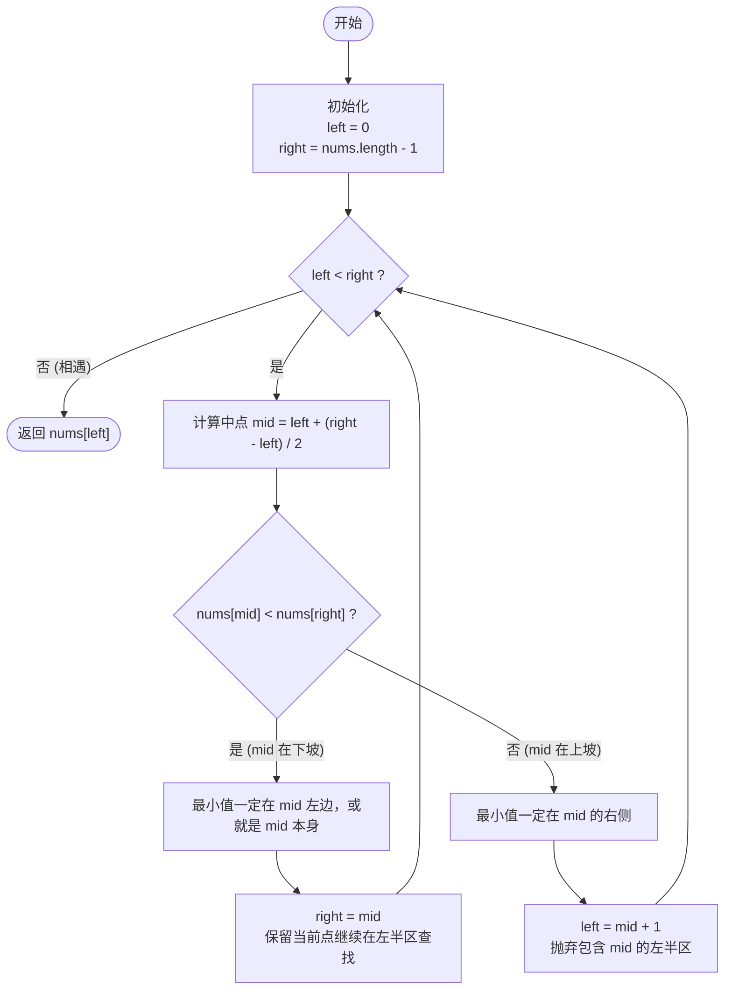

# LeetCode 153 - 寻找旋转排序数组中的最小值 (Find Minimum in Rotated Sorted Array) 详解

## 题目描述

已知一个长度为 `n` 的数组，预先按照升序排列，经由 `1` 到 `n` 次 **旋转** 后，得到输入数组。例如，原数组 `nums = [0,1,2,4,5,6,7]` 在变化后可能得到：
- 若旋转 4 次，则可以得到 `[4,5,6,7,0,1,2]`
- 若旋转 7 次，则可以得到 `[0,1,2,4,5,6,7]`

注意，数组 `[a[0], a[1], a[2], ..., a[n-1]]` **旋转一次** 的结果为数组 `[a[n-1], a[0], a[1], a[2], ..., a[n-2]]`。

给你一个元素值 **互不相同** 的数组 `nums` ，它原来是一个升序排列的数组，并按上述情形进行了多次旋转。请你找出并返回数组中的 **最小元素** 。

**要求：** 你必须设计一个时间复杂度为 `O(log n)` 的算法解决此问题。

---

## 解法分析

在你的代码中，存在两种解法：

| 解法 | 策略 | 时间复杂度 | 空间复杂度 | 评析 |
|------|------|-----------|-----------|------|
| `findMin` | 模拟倒推还原 | O(n²) | O(n) | 不符合题目 `O(log n)` 要求，会超时 |
| `findMin2`| 二分查找 | **O(log n)** | O(1) | **最优解**，符合要求 |

---

## 解法一：模拟倒推还原 (不推荐)

### 核心思路

既然数组是升序数组不断向右循环移位得到的，那只要 `nums[0] > nums[最后一位]`，就说明数组处于被截断的乱序状态。
代码通过不断地把数组向右移位（手动写了一个函数 `f` 每次向右推一位），尝试把数组“转回来”，直到第一位比最后一位小，此时说明数组恢复了完全升序，第一位就是最小值。

### 代码详解与缺点

```java
public int findMin(int[] nums){
    if(nums.length==1) return nums[0];
    int count=0;
    // 只要首 > 尾，持续循环还原
    while(nums[0]>nums[nums.length-1]){
        nums=f(nums); // 每次调用都新创建数组，挪动所有元素
        count++;
    }
    return nums[0];
}

// 暴力向右平移一位
public int[] f(int[] nums){
    int[] res=new int[nums.length];
    for(int i=0;i<nums.length-1;i++){
        res[i+1]=nums[i];
    }
    res[0]=nums[nums.length-1];
    return res;
}
```

**❌ 为什么这种做法极度不推荐？**
1. **时间炸弹**：最坏情况下（比如数组旋转了1次），while 循环要执行 `n-1` 次，每次执行 `f` 函数又要遍历 `n` 个元素。总时间复杂度高达 **O(n²)**。
2. **空间炸弹**：每次调用 `f(nums)` 都会 `new int[nums.length]` 产生一个全新的数组对象，非常浪费内存，空间复杂度相当于 **O(n)** 并在内存中产生大量垃圾对象。

---

## 解法二：二分查找 (最优解 O(log n))

由于要求 `O(log n)` 的时间复杂度，这几乎是**二分查找**的明示。

### 核心难点与思路

旋转过的数组有什么规律？
长这样：`[4, 5, 6, 7, 0, 1, 2]`

可以将它看成**两个上升的斜坡**。并且，**左边坡的所有值，都严格大于右边坡的所有值**。
最小值就是**右边坡的谷底（第一个元素）**。

我们在二分查找时，计算处于中间的元素 `mid`。我们要判断 `mid` 是在左坡还是右坡：
通过将 `nums[mid]` 和 **最右边的元素** `nums[right]` 进行对比：

1. **情况 A：`nums[mid] < nums[right]`**
   说明从 `mid` 到 `right` 这一段是严格递增的。
   这就意味着 `mid` 处在**右边那个较低的坡**上。
   既然右边都是递增的，那么最小值肯定在 `mid` 的**左边**（或者 `mid` 本身就是谷底）。
   👉 **动作**：砍掉右半边，把搜索范围缩小到左边，令 `right = mid`。（不能写 `right = mid - 1`，因为 `mid` 自己可能就是最小值，排除了就不对了）。

2. **情况 B：`nums[mid] > nums[right]`**
   说明 `mid` 的值比尽头的 `right` 还要大。
   这只有一种可能：`mid` 处在**左边那个较高的坡**上。
   最小值（谷底）一定在 `mid` 的**右边**。
   👉 **动作**：砍掉左半边。既然 `mid` 在高坡上，`mid` 肯定不是最小值，所以可以直接让 `left = mid + 1`。

3. *(扩展)* **如果 `nums[mid] == nums[right]` 呢？**
   本题明确说**互不相同**，所以不可能在此题出现。如果有重复元素，直接 `right--` 即可（见 LeetCode 154 题）。

### 代码详解

```java
public int findMin2(int[] nums){
    int left=0;
    int right=nums.length-1;

    // 循环条件 left < right
    // 当 left == right 时，我们就找到了最小值，循环结束
    while(left<right){
        // 计算中间索引
        int mid=left+(right-left)/2;

        if (nums[mid] < nums[right]) {
            // 情况 A：右边有序，mid 在右坡，最小值在左边或 mid 本身
            // 此时 mid 可能是最小值，所以不能排除 mid
            right = mid;
        } else {
            // 情况 B：mid 比 right 大，mid 在左边的高坡上
            // 最小值一定在 mid 的右边
            // 此时 mid 肯定不是最小值，可以将其排队
            left = mid + 1;
        }
    }
    // 循环结束时，left 和 right 会相遇，指向同一个位置，即为最小值
    return nums[left];
}
```

### 逐步执行示例

以数组 `nums = [4, 5, 6, 7, 0, 1, 2]` 为例：

1. `left = 0`, `right = 6`, `mid = 3` (`nums[3] = 7`)
   因为 `7 > nums[right](2)`，在左坡高处。
   更新 `left = mid + 1 = 4`。

2. `left = 4`, `right = 6`, `mid = 5` (`nums[5] = 1`)
   因为 `1 < nums[right](2)`，在右坡。最小值在左或本身。
   更新 `right = mid = 5`。

3. `left = 4`, `right = 5`, `mid = 4` (`nums[4] = 0`)
   因为 `0 < nums[right](1)`，在右坡。
   更新 `right = mid = 4`。

4. 此时 `left = 4`, `right = 4`，循环终止。返回 `nums[4]`，值为 `0`。正确！

---

## 核心流程图 (二分查找法)


