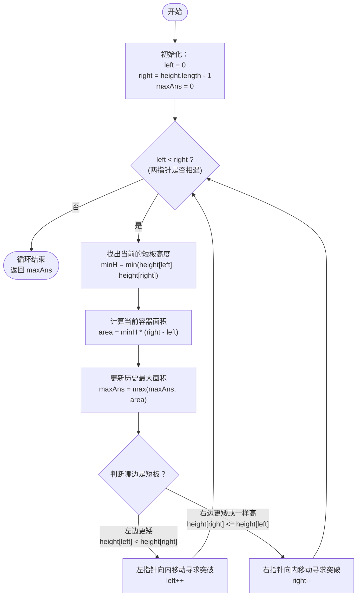

# LeetCode 11 - 盛最多水的容器 (Container With Most Water) 详解

## 题目描述

给定一个长度为 `n` 的整数数组 `height` 。有 `n` 条垂线，第 `i` 条线的两个端点是 `(i, 0)` 和 `(i, height[i])` 。
找出其中的两条线，使得它们与 x 轴共同构成的容器可以容纳最多的水。
返回容器可以储存的最大水量。

**说明：** 你不能倾斜容器。

**示例：**
输入：`[1,8,6,2,5,4,8,3,7]`
输出：`49` 
解释：在这个数组中，选择下标 1（高度为 8）和下标 8（高度为 7），宽度为 8 - 1 = 7，最短板为 7，面积为 7 * 7 = 49。

---

## 🚨 重要发现：代码中存在一个 Bug

在详细分析之前，我注意到你的代码中存在一个**逻辑错误（Bug）**：

```java
// 你的原代码：
// 计算当前木桶短板的高度
int minH = Math.max(height[left], height[right]); 
```

**木桶原理决定了，能够装多少水，取决于【最短】的那块木板。**
所以这里计算短板高度，应该使用 `Math.min()` 而不是 `Math.max()`。使用 `max` 会导致计算出的面积偏大（水会漏出来）。正确的写法应该是：
`int minH = Math.min(height[left], height[right]);`

*(接下来的分析和推演，都将基于**正确**的 `Math.min` 逻辑来进行解答)*

---

## 解法分析：双指针向内收缩 (贪心策略) O(n)

### 核心思维

我们要寻找最大容积，容积公式为：
**容积 = 两个指针指向的短板高度 × 两个指针之间的距离**
即 `Area = min(height[left], height[right]) * (right - left)`

如果使用双层循环暴力枚举所有组合，时间复杂度是 $O(n^2)$，会超时。
我们可以使用**双指针法**来进行优化：
1. **初始化**：把两个指针分别放在数组的最头 `left = 0` 和最尾 `right = n - 1`。此时，**宽度是最宽的**。
2. **贪心收缩**：我们要向内移动指针，宽度 `(right - left)` 肯定会变小。为了能在这个变小的宽度下找到更大的面积，我们**只能寄希望于找到更高的板子**。
   - 如果我们移动**长板**，短板没变或变得更短，面积无论如何一定会变小。
   - 如果我们移动**短板**，新的短板可能会变长，面积**有可能**会变大。
3. **决策**：所以，每次计算完当前面积后，**谁小就移动谁**（短板向内移动）。一直移动到两个指针相遇为止。

---

## 代码详解 (订正后)

```java
public class maxArea11 {
    public int maxArea(int[] height){
        // 1. 定义左右双指针，放在最两端（此时宽度最大）
        int left = 0;
        int right = height.length - 1;

        int maxAns = 0;

        // 2. 双指针向中间靠拢
        // 注意：计算面积需要宽度，left == right 时宽度为0，没必要算，写 < 就可以
        while(left < right){
            // 🐛 修复处：计算当前木桶短板的高度，必须用 Math.min
            int minH = Math.min(height[left], height[right]);

            // 计算当前面积 宽*高
            int currentArea = (right - left) * minH;

            // 更新历史最大值
            maxAns = Math.max(maxAns, currentArea);

            // 3. 核心决策：移动短处的指针（贪心策略）
            // 谁矮谁就往往里走，寻找变高的可能性
            if(height[left] < height[right]){
                left++;
            }else{
                right--;
            }
        }
        return maxAns;
    }
}
```

---

## 示例详细推演

以简化版数组 `height = [1, 8, 6, 2, 5, 4, 8, 3, 7]` 为例：
*(数组对应下标为 0 到 8)*

**初始状态：**
`left = 0` (高度为 `1`)， `right = 8` (高度为 `7`)
最大面积 `maxAns = 0`

### 第一轮：
1. 短板：`min(1, 7) = 1`
2. 宽度：`8 - 0 = 8`
3. 容积：`1 * 8 = 8`
4. 更新最大值：`maxAns = max(0, 8) = 8`
5. **决策**：`height[left](1) < height[right](7)`，移动**短板** `left`。
   👉 调整后：`left` 移到下标 1 (`高度 8`)。

### 第二轮：
1. 此时 `left = 1` (高度 `8`)， `right = 8` (高度 `7`)
2. 短板：`min(8, 7) = 7`
3. 宽度：`8 - 1 = 7`
4. 容积：`7 * 7 = 49`
5. 更新最大值：`maxAns = max(8, 49) = 49`
6. **决策**：`height[right](7) < height[left](8)`，移动**短板** `right`。
   👉 调整后：`right` 移到下标 7 (`高度 3`)。

### 第三轮：
1. 此时 `left = 1` (高度 `8`)， `right = 7` (高度 `3`)
2. 短板：`min(8, 3) = 3`
3. 宽度：`7 - 1 = 6`
4. 容积：`3 * 6 = 18`
5. 更新最大值：`maxAns = max(49, 18) = 49`
6. **决策**：`height[right](3) < height[left](8)`，移动**短板** `right`。
   👉 调整后：`right` 移到下标 6 (`高度 8`)。

### 第四轮：
1. 此时 `left = 1` (高度 `8`)， `right = 6` (高度 `8`)
2. 短板：`min(8, 8) = 8`
3. 宽度：`6 - 1 = 5`
4. 容积：`8 * 5 = 40`
5. 更新最大值：`maxAns = max(49, 40) = 49`
6. **决策**：两板一样高，平局，随便移动哪边都行（因为只移动一边，新面积肯定更小，最终都会走向更里面）。代码执行 `right--`。
   👉 调整后：`right` 移到下标 5 (`高度 4`)。

> *(此后指针继续往内收缩，面积均无法超越 49，最终 `left == right` 循环结束。)*

最终结果返回： **49**。

---

## 核心流程图 (双指针贪心策略)


