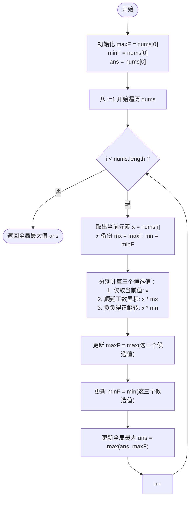

# LeetCode 152 - 乘积最大子数组 (Maximum Product Subarray) 详解

## 题目描述

给你一个整数数组 `nums` ，请你找出数组中乘积最大的非空连续子数组（该子数组中至少包含一个数字），并返回该子数组所对应的乘积。

**示例**：
- `nums = [2, 3, -2, 4]` → 输出 `6`（子数组 `[2, 3]`）
- `nums = [-2, 0, -1]` → 输出 `0`（子数组 `[0]`）

---

## 解法分析：动态规划 O(n)

### 核心难点（为什么不能直接套用最大子数组和的Kadane算法？）

在求**最大和**时，如果前面的和是负数，我们可以直接扔掉。
但是求**最大乘积**时，如果前面的乘积是负数，**不能直接扔掉**！因为如果当前元素也是一个负数，"负负得正"，它可能会瞬间反转变成一个极大的正数。

### 核心思路

为了处理"负负得正"的情况，我们需要同时维护**两个状态**：
1. `maxF`：以当前元素结尾的**最大乘积**（正数的情况，尽可能大）
2. `minF`：以当前元素结尾的**最小乘积**（负数的情况，尽可能小，为了将来可能翻转成大正数）

对于当前元素 `x`，新的最大/最小乘积只可能从以下三种情况中产生：
1. **元素本身** `x`（之前的积累不要了，从当前开始算）
2. **`x * 之前的最大乘积`**（如果 `x` 是正数，乘之前的最大值会更大）
3. **`x * 之前的最小乘积`**（如果 `x` 是负数，乘之前的最小值"负负得正"会变得极大）

所以，状态转移方程为：
- `新 maxF = max(x, x * 旧maxF, x * 旧minF)`
- `新 minF = min(x, x * 旧maxF, x * 旧minF)`

---

## 代码详解

```java
public class maxProduct152 {
    public int maxProduct(int[] nums){
        // 1. 初始化
        // maxF: 以当前元素结尾的最大乘积
        // minF: 以当前元素结尾的最小乘积
        int maxF = nums[0];
        int minF = nums[0];
        // ans: 全局最大值遍历记录
        int ans = nums[0];

        // 2. 从第二个元素开始遍历
        for(int i = 1; i < nums.length; i++){
            // 🚨 重点：由于计算新的 maxF 时会覆盖旧的 maxF 的值，
            // 而下一步计算 minF 时还需要用到旧的 maxF，所以必须先备份存起来
            int mx = maxF;
            int mn = minF;

            // 3. 核心状态转移
            // 当前的最大值 = max(当前值, 当前值*旧最大, 当前值*旧最小)
            maxF = Math.max(nums[i], Math.max(nums[i] * mx, nums[i] * mn));

            // 当前的最小值 = min(当前值, 当前值*旧最大, 当前值*旧最小)
            minF = Math.min(nums[i], Math.min(nums[i] * mx, nums[i] * mn));

            // 4. 更新全局结果
            ans = Math.max(ans, maxF);
        }
        return ans;
    }
}
```

---

## 逐步执行示例

以 `nums = [2, 3, -2, 4]` 为例：

| 步骤 (i) | 当前元素 (`nums[i]`) | 旧 maxF (`mx`) | 旧 minF (`mn`) | 候选集合 (`x`, `x*mx`, `x*mn`) | 新的 maxF (取最大) | 新的 minF (取最小) | 全局最大 ans |
|---------|---------------------|---------------|---------------|-----------------------------|-----------------|-----------------|-------------|
| 初始化   | nums[0] = 2         | -             | -             | -                           | 2               | 2               | 2           |
| 1       | 3                   | 2             | 2             | `(3, 3*2=6, 3*2=6)`         | **6**           | 3               | **6**       |
| 2       | -2                  | 6             | 3             | `(-2, -2*6=-12, -2*3=-6)`   | -2              | **-12**         | 6           |
| 3       | 4                   | -2            | -12           | `(4, 4*-2=-8, 4*-12=-48)`   | 4               | -48             | 6           |

最终返回：**6**

💡 **负负得正的例子**：
假设数组是 `[-2, 3, -4]`：
遇到 `-4` 前：`maxF = 3`，`minF = -6`
遇到 `-4` 后：可以计算 `-4 * 旧minF(-6)` = **24**，瞬间得到最大正数！

---

## 核心流程图 (状态转移)



### 为什么必须备份？

> **注意：** 在循环中，我们有这两行代码：
> ```java
> int mx = maxF; 
> int mn = minF;
> ```
> 这是因为 `maxF` 更新后，它的值就变了。在紧接着计算 `minF` 时，如果直接写 `Math.min(..., nums[i] * maxF, ...)`，此时用到的就是被污染过的新 `maxF`，会导致计算出错。这就是为什么要提前备份 `mx` 和 `mn`。
