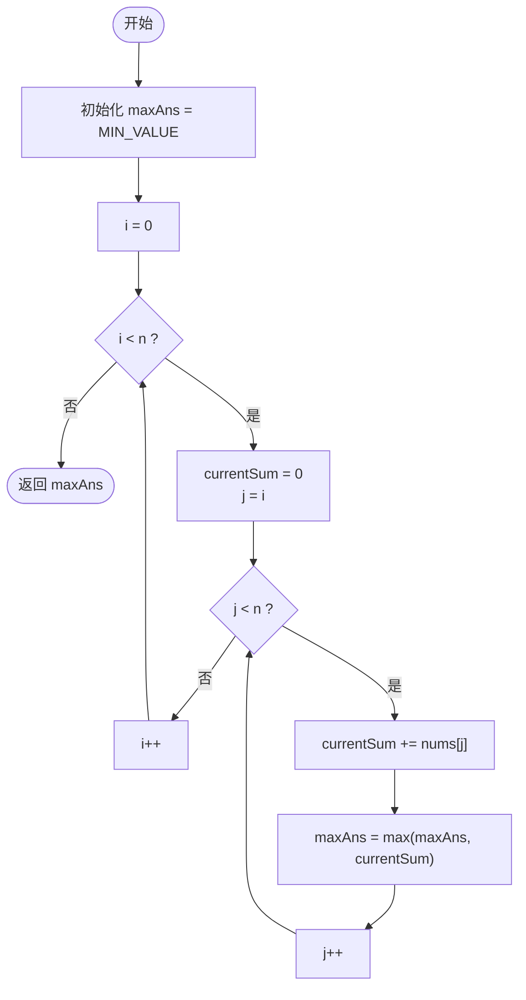
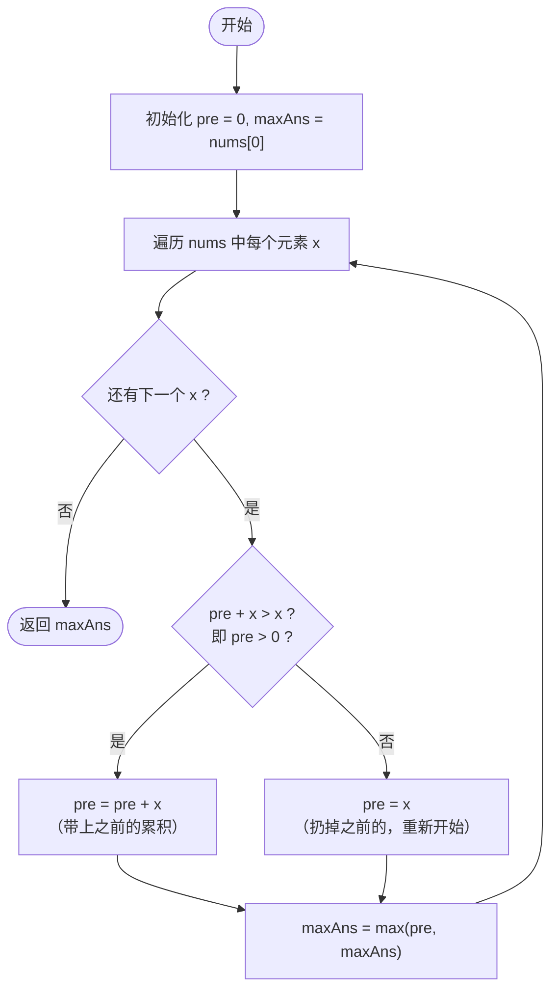
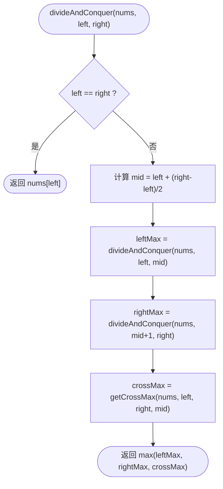
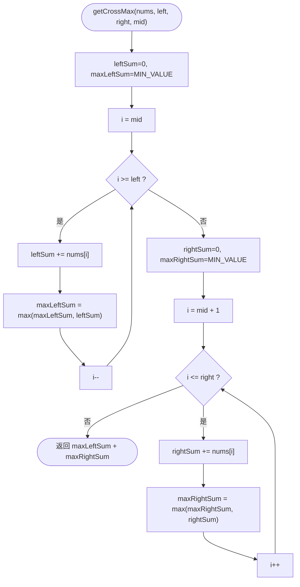
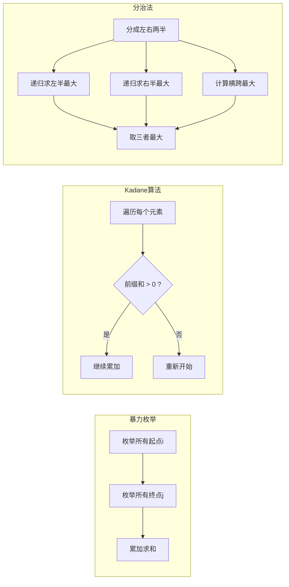

# LeetCode 53 - 最大子数组和 (Maximum Subarray) 详解

## 题目描述

给定一个整数数组 `nums`，找到一个连续子数组（至少包含一个元素），使其和最大，返回其最大和。

**示例**：`nums = [-2, 1, -3, 4, -1, 2, 1, -5, 4]` → 输出 `6`（子数组 `[4, -1, 2, 1]`）

---

## 三种解法总览

| 解法 | 方法 | 时间复杂度 | 空间复杂度 |
|------|------|-----------|-----------|
| `maxSubArray` | 暴力枚举 | O(n²) | O(1) |
| `maxSubArray2` | 动态规划 (Kadane) | O(n) | O(1) |
| `maxSubArray3` | 分治法 | O(n log n) | O(log n) |

---

## 解法一：暴力枚举 O(n²)

### 核心思路

枚举所有可能的子数组 `[i..j]`，计算每个子数组的和，取最大值。

### 代码详解

```java
public int maxSubArray(int[] nums){
    int n = nums.length;
    int maxAns = Integer.MIN_VALUE;  // ① 初始化为极小值，防止全负数

    for(int i = 0; i < n; i++){      // ② 枚举起点 i
        int currentSum = 0;
        for(int j = i; j < n; j++){  // ③ 枚举终点 j（从 i 开始）
            currentSum += nums[j];   // ④ 累加当前元素
            maxAns = Math.max(maxAns, currentSum); // ⑤ 更新全局最大
        }
    }
    return maxAns;
}
```

### 逐步执行示例

以 `nums = [-2, 1, -3, 4]` 为例：

| i | j | currentSum | maxAns |
|---|---|-----------|--------|
| 0 | 0 | -2 | -2 |
| 0 | 1 | -1 | -1 |
| 0 | 2 | -4 | -1 |
| 0 | 3 | 0 | 0 |
| 1 | 1 | 1 | 1 |
| 1 | 2 | -2 | 1 |
| 1 | 3 | 2 | 2 |
| 2 | 2 | -3 | 2 |
| 2 | 3 | 1 | 2 |
| 3 | 3 | 4 | **4** |

### 核心流程图



---

## 解法二：动态规划 / Kadane 算法 O(n)

### 核心思路

定义 `pre` = **以当前元素结尾的最大子数组和**。对于每个新元素 `x`，做一个决策：

- **`pre > 0`** → 之前的累积是正收益，带上它：`pre = pre + x`
- **`pre ≤ 0`** → 之前的累积是负担，扔掉，从 `x` 重新开始：`pre = x`

合并为一行：**`pre = max(pre + x, x)`**

### 代码详解

```java
public int maxSubArray2(int[] nums){
    int pre = 0;           // ① 以当前元素结尾的最大子数组和
    int maxAns = nums[0];  // ② 全局最大和（初始化为第一个元素）

    for(int x : nums){
        pre = Math.max(pre + x, x);      // ③ 核心决策
        maxAns = Math.max(pre, maxAns);   // ④ 更新全局最大
    }
    return maxAns;
}
```

### 逐步执行示例

以 `nums = [-2, 1, -3, 4, -1, 2, 1, -5, 4]` 为例：

| 步骤 | x | pre+x | x | pre = max(...) | maxAns | 决策说明 |
|------|---|-------|---|----------------|--------|---------|
| 1 | -2 | -2 | -2 | -2 | -2 | 初始，只能选 -2 |
| 2 | 1 | -1 | 1 | **1** | 1 | 前面和为负，扔掉，从 1 重新开始 |
| 3 | -3 | -2 | -3 | **-2** | 1 | 带上前面的 1，虽然总和变负 |
| 4 | 4 | 2 | 4 | **4** | 4 | 前面和为负，扔掉，从 4 重新开始 |
| 5 | -1 | 3 | -1 | **3** | 4 | 带上前面的 4 |
| 6 | 2 | 5 | 2 | **5** | 5 | 带上前面的 3 |
| 7 | 1 | 6 | 1 | **6** | **6** | 带上前面的 5 |
| 8 | -5 | 1 | -5 | **1** | 6 | 带上前面的 6 |
| 9 | 4 | 5 | 4 | **5** | 6 | 带上前面的 1 |

最终结果：**6**，对应子数组 `[4, -1, 2, 1]`

### 核心流程图



### 为什么 Kadane 是正确的？

> **关键洞察**：最大子数组一定以某个元素结尾。如果我们能求出以每个元素结尾的最大子数组和，取全局最大即为答案。
>
> **状态转移方程**：`dp[i] = max(dp[i-1] + nums[i], nums[i])`
>
> 由于 `dp[i]` 只依赖 `dp[i-1]`，所以用一个变量 `pre` 滚动即可，空间优化到 O(1)。

---

## 解法三：分治法 O(n log n)

### 核心思路

将数组从中间一分为二，最大子数组只可能出现在三个位置：

1. **完全在左半部分** → 递归求解
2. **完全在右半部分** → 递归求解
3. **横跨中间** → 从中点向两边扩展求最大

返回三者中的最大值。

### 代码详解

```java
// 主入口
public int maxSubArray3(int[] nums){
    return divideAndConquer(nums, 0, nums.length - 1);
}

// 分治递归函数
private int divideAndConquer(int[] nums, int left, int right){
    if(left == right) return nums[left];  // ① 递归终止：只有一个元素

    int mid = left + (right - left) / 2;  // ② 计算中点

    int leftMax  = divideAndConquer(nums, left, mid);     // ③ 左半最大
    int rightMax = divideAndConquer(nums, mid+1, right);  // ④ 右半最大
    int crossMax = getCrossMax(nums, left, right, mid);   // ⑤ 横跨最大

    return Math.max(leftMax, Math.max(rightMax, crossMax)); // ⑥ 三者取最大
}

// 计算横跨中间的最大子数组和
private int getCrossMax(int[] nums, int left, int right, int mid){
    // 从 mid 向左扫描，求左半最大和
    int leftSum = 0, maxLeftSum = Integer.MIN_VALUE;
    for(int i = mid; i >= left; i--){
        leftSum += nums[i];
        maxLeftSum = Math.max(maxLeftSum, leftSum);
    }

    // 从 mid+1 向右扫描，求右半最大和
    int rightSum = 0, maxRightSum = Integer.MIN_VALUE;
    for(int i = mid+1; i <= right; i++){
        rightSum += nums[i];
        maxRightSum = Math.max(maxRightSum, rightSum);
    }

    return maxLeftSum + maxRightSum;  // 合并左右
}
```

### 逐步执行示例

以 `nums = [-2, 1, -3, 4]` (索引 0~3) 为例：

```
divideAndConquer([−2, 1, −3, 4], 0, 3)
├── mid = 1
├── leftMax = divideAndConquer(0, 1)
│   ├── mid = 0
│   ├── leftMax = divideAndConquer(0, 0) → −2
│   ├── rightMax = divideAndConquer(1, 1) → 1
│   ├── crossMax = getCrossMax(0, 1, 0)
│   │   ├── 左扫：nums[0] = −2 → maxLeftSum = −2
│   │   └── 右扫：nums[1] = 1 → maxRightSum = 1
│   │   └── cross = −2 + 1 = −1
│   └── return max(−2, 1, −1) = 1
│
├── rightMax = divideAndConquer(2, 3)
│   ├── mid = 2
│   ├── leftMax = divideAndConquer(2, 2) → −3
│   ├── rightMax = divideAndConquer(3, 3) → 4
│   ├── crossMax = getCrossMax(2, 3, 2)
│   │   ├── 左扫：nums[2] = −3 → maxLeftSum = −3
│   │   └── 右扫：nums[3] = 4 → maxRightSum = 4
│   │   └── cross = −3 + 4 = 1
│   └── return max(−3, 4, 1) = 4
│
├── crossMax = getCrossMax(0, 3, 1)
│   ├── 左扫：nums[1]=1 → sum=1, max=1; nums[0]=−2 → sum=−1, max=1
│   │   → maxLeftSum = 1
│   └── 右扫：nums[2]=−3 → sum=−3, max=−3; nums[3]=4 → sum=1, max=1
│       → maxRightSum = 1
│   └── cross = 1 + 1 = 2
│
└── return max(1, 4, 2) = 4 ✅
```

### 核心流程图

#### divideAndConquer 主流程



#### getCrossMax 子流程



---

## 三种解法横向对比



> **面试推荐**：优先掌握 **Kadane 算法**（解法二），它是最优解，代码简洁且时间空间复杂度最优。分治法常作为进阶考察点。
