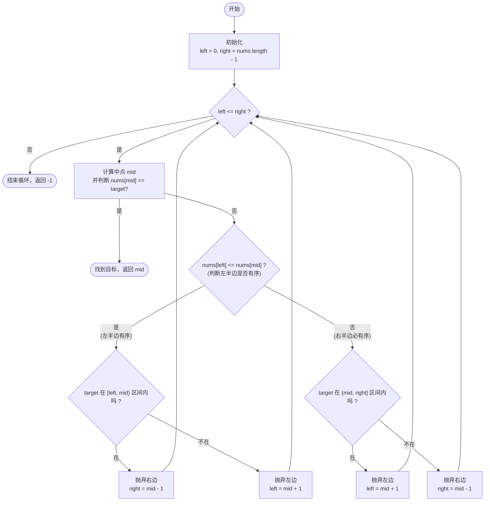

# LeetCode 33 - 搜索旋转排序数组 (Search in Rotated Sorted Array) 详解

## 题目描述

整数数组 `nums` 按升序排列，数组中的值 **互不相同**。

在传递给函数之前，`nums` 在预先未知的某个下标 `k`（`0 <= k < nums.length`）上进行了 **旋转**，使数组变为 `[nums[k], nums[k+1], ..., nums[n-1], nums[0], nums[1], ..., nums[k-1]]`（下标 **0-索引**）。例如， `[0,1,2,4,5,6,7]` 在下标 3 处经旋转后可能变为 `[4,5,6,7,0,1,2]`。

给你 **旋转后** 的数组 `nums` 和一个整数 `target` ，如果 `nums` 中存在这个目标值 `target` ，则返回它的下标，否则返回 `-1`。

**要求：** 你必须设计一个时间复杂度为 `O(log n)` 的算法解决此问题。

---

## 解法分析：二分查找 O(log n)

### 核心思维

数组被旋转后，变成了两段**各自有序**的序列（比如 `[4,5,6,7]` 和 `[0,1,2]`）。
无论我们在哪一个位置 `mid` 切一刀，**`[left...mid]` 和 `[mid...right]` 这两半部分中，必定至少有一半是完全有序的**。

这就给我们二分查找提供了依据：
1. 找出哪一半是有序的。
2. 判断 `target` 是不是在这个“有序的半边”里。
   - 如果在，就在这个有序半边继续二分。
   - 如果不在，那说明 `target` 肯定在另外一个“无序的半边”里，去那边继续寻找。

---

## 代码详解

```java
public class search33 {
    public int search(int[] nums, int target){
        int left = 0;
        int right = nums.length - 1;

        while(left <= right){
            int mid = left + (righ - left) / 2;

            // 1. 如果 mid 刚好猜中了，直接返回
            if(nums[mid] == target){
                return mid;
            }

            // 2. 判断哪一半是有序的
            // 💡 技巧：如果最左边的元素 <= 中间的元素，说明 [left...mid] 是连贯的递增区间
            if(nums[left] <= nums[mid]){
                
                // --- 左半边 [left...mid] 是有序的 ---

                // 检查 target 是否落在这个有序区间的范围里
                //（即 target 介于 left 和 mid 之间）
                if(nums[left] <= target && target < nums[mid]){
                    // 如果在，砍掉右边
                    right = mid - 1;
                }else{
                    // 如果不在，说明 target 在无序的那一半，去右边找
                    left = mid + 1;
                }
            }else{
                
                // --- 左半边无序，那右半边 [mid...right] 必定是有序的 ---
                // 因为数组总共就截成了两段递增区间

                // 检查 target 是否落在这个右半边有序区间的范围里
                if(nums[mid] < target && target <= nums[right]){
                    // 如果在，砍掉左边
                    left = mid + 1;
                }else{
                    // 如果不在，去另一半找
                    right = mid - 1;
                }
            }
        }
        
        // 循环结束都没找到
        return -1;
    }
}
```

---

## 示例详细推演

以经典旋转数组 `nums = [4, 5, 6, 7, 0, 1, 2]`，目标值 `target = 0` 为例。

**初始状态：**
`left = 0` (值为 4)， `right = 6` (值为 2)

### 第一轮循环：
1. 计算中点：`mid = (0 + 6) / 2 = 3`，对应的值 `nums[3] = 7`。
2. 不是目标值 `0`。判断哪边有序：
   `nums[left](4) <= nums[mid](7)` 成立，说明 **左半边 `[4, 5, 6, 7]` 是完全有序的**。
3. 判断 `target`(0) 是否在有序区间 `[4, 7]` 内：
   `4 <= 0 < 7` **不成立**。这就意味着 0 不在这半边。
4. 去右边找：`left = mid + 1 = 4`。
   当前区间变成 `[0, 1, 2]`。

### 第二轮循环：
1. 此时 `left = 4` (值为 0)， `right = 6` (值为 2)。
2. 计算中点：`mid = (4 + 6) / 2 = 5`，对应的值 `nums[5] = 1`。
3. 不是目标值 `0`。判断哪边有序：
   `nums[left](0) <= nums[mid](1)` 成立，说明 **左半边 `[0, 1]` 是完全有序的**。
4. 判断 `target`(0) 是否在有序区间 `[0, 1]` 内：
   `0 <= 0 < 1` **成立！**，说明就在这半边。
5. 去左边找（因为这里就是当前子数组的左半边）：`right = mid - 1 = 4`。

### 第三轮循环：
1. 此时 `left = 4`，`right = 4`，循环条件 `left <= right` 依然成立。
2. 计算中点：`mid = (4 + 4) / 2 = 4`，对应的值 `nums[4] = 0`。
3. `nums[mid](0) == target(0)` **匹配成功！**
4. 直接 return `mid` (即 `4`)。

**✅ 推演结果正确。**

---

## 核心流程图 (二分查找分支)


