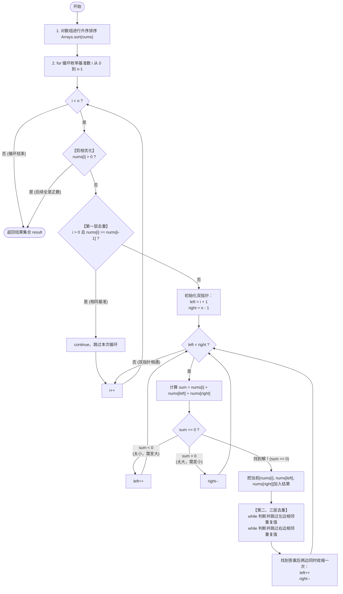

# LeetCode 15 - 三数之和 (3Sum) 详解

## 题目描述

给你一个整数数组 `nums` ，判断是否存在三元组 `[nums[i], nums[j], nums[k]]` 满足 `i != j`、`i != k` 且 `j != k` ，同时还满足 `nums[i] + nums[j] + nums[k] == 0` 。

请你返回所有和为 `0` 且 **不重复** 的三元组。

**注意：** 答案中不可以包含重复的三元组。

**示例：**
输入：`nums = [-1,0,1,2,-1,-4]`
输出：`[[-1,-1,2],[-1,0,1]]`

---

## 解法分析：排序 + 双指针 O(n²)

### 核心思维

找三个数之和等于 0，暴力枚举需要三层循环 $O(n^3)$，不仅会超时，而且去重极度困难。
**优化核心思路：固定一个数，找另外两个数。**

当我们把数组**从小到大排序**后，一切都变得简单了：
1. 我们通过第一层循环，依次枚举第一个数 `nums[i]` 作为“基准数”。
2. 因为数组有序，剩下的两个数可以使用**双指针**（左右夹击算法）：
   - `left` 指针指向 `i + 1`，`right` 指针指向数组最末尾。
   - 三数之和 `sum = nums[i] + nums[left] + nums[right]`。
   - 如果 `sum > 0`，说明太大了，把 `right` 往左移（减小数值）。
   - 如果 `sum < 0`，说明太小了，把 `left` 往右移（增大数值）。
   - 如果 `sum == 0`，找到了答案，记录下来！

### 最大难点：如何去重？

题目要求“不可以包含重复的三元组”。由于我们排过序，相同的数字肯定挨在一起，去重就变成了**跳过连续相同的数字**：
1. **基准数去重**：如果 `nums[i] == nums[i-1]`，直接跳过。
2. **左指针去重**：找到答案后，如果下一个 `nums[left]` 和当前一样，跳过。
3. **右指针去重**：找到答案后，如果下一个 `nums[right]` 和当前一样，跳过。

---

## 代码详解

```java
public class threeSum15 {
    public List<List<Integer>> threeSum(int[] nums){
        List<List<Integer>> result = new ArrayList<>();

        // 1. 必须先排序！！！这是双指针和去重的前提
        Arrays.sort(nums);
        int n = nums.length;

        // 2. 遍历每一个数作为基准数 nums[i]
        for(int i = 0; i < n; i++){
            // 剪枝优化：如果排序后第一个数都大于0，
            // 后面全都是正数，相加绝对不可能等于0，直接提前结束整个循环
            if(nums[i] > 0) break;

            // 核心去重 1：基准数去重
            // 如果遇到和前一个基准数相同的数，跳过（因为解肯定和之前找过的一模一样）
            if(i > 0 && nums[i] == nums[i-1]){
                continue;
            }

            // 3. 双指针寻找另外两个数
            int left = i + 1;
            int right = n - 1;

            while(left < right){
                int sum = nums[i] + nums[left] + nums[right];

                if(sum == 0){
                    // 🎉 找到一组解，加入结果集
                    result.add(Arrays.asList(nums[i], nums[left], nums[right]));

                    // 核心去重 2：左指针遇到重复值，跳过
                    // 注意循环条件 left < right，防止越界交错
                    while(left < right && nums[left] == nums[left + 1]){
                        left++;
                    }
                    // 核心去重 3：右指针遇到重复值，跳过
                    while (left < right && nums[right] == nums[right - 1]) {
                        right--;
                    }

                    // 💡 注意：不仅越过重复值，左右指针自己还要再走一步，去判断新的数对
                    left++;
                    right--;

                } else if(sum < 0){
                    // 和太小，由于数组有序，只能让较小的数字变大，所以左指针右移
                    left++;
                } else {
                    // 和太大，由于数组有序，只能让较大的数字变小，所以右指针左移
                    right--;
                }
            }
        }
        return result;
    }
}
```

---

## 示例详细推演

以经典示例 `nums = [-1, 0, 1, 2, -1, -4]` 为例：

**Step 0: 排序**
排序后：`nums = [-4, -1, -1, 0, 1, 2]`

### 第一大轮：基准数 `nums[0] = -4`
`i = 0` (`-4`)
初始化双指针：`left = 1` (`-1`)，`right = 5` (`2`)

1. 三数和 `sum = (-4) + (-1) + 2 = -3 < 0` （太小了）
   👉 调整：`left++`，`left` 移到下标 2（值 `-1`）。
2. 三数和 `sum = (-4) + (-1) + 2 = -3 < 0` （太小了）
   👉 调整：`left++`，`left` 移到下标 3（值 `0`）。
3. 三数和 `sum = (-4) + 0 + 2 = -2 < 0` （太小了）
   👉 调整：`left++`，`left` 移到下标 4（值 `1`）。
4. 三数和 `sum = (-4) + 1 + 2 = -1 < 0` （太小了）
   👉 调整：`left++`，与 `right` 相遇，此轮结束。

### 第二大轮：基准数 `nums[1] = -1`
`i = 1` (`-1`)
初始化双指针：`left = 2` (`-1`)，`right = 5` (`2`)

1. 三数和 `sum = (-1) + (-1) + 2 = 0` （**🎉等于 0！找到解**）
   👉 **记录解**：`[-1, -1, 2]`
   👉 **查重并收缩**：
   `nums[left](-1) != nums[left+1](0)`，无重复。
   `nums[right](2) != nums[right-1](1)`，无重复。
   `left++` 变成下标 3（值 `0`），`right--` 变成下标 4（值 `1`）。

2. 此时 `left = 3` (`0`)，`right = 4` (`1`)。
   三数和 `sum = (-1) + 0 + 1 = 0` （**🎉等于 0！找到解**）
   👉 **记录解**：`[-1, 0, 1]`
   👉 **查重并收缩**：双指针调整后交叉，此轮结束。

### 第三大轮：基准数 `nums[2] = -1`
`i = 2` (`-1`)
⚠️ 这是核心去重时刻！
发现 `nums[2] == nums[1]`（都是 `-1`），刚才用 `-1` 作为头牌的组合已经穷尽了，再用它开头只会找到重复的组合。
👉 **触发去重：`continue` 直接跳过！**

### 第四大轮：基准数 `nums[3] = 0`
`i = 3` (`0`)
初始化双指针：`left = 4` (`1`)，`right = 5` (`2`)

1. 三数和 `sum = 0 + 1 + 2 = 3 > 0` （太大了）
   👉 调整：`right--`，并与 `left` 交叉，此轮结束。

### 第五、六轮：
`nums[4] = 1`, `nums[5] = 2`
满足 `nums[i] > 0`，后面的数都是正数，不可能加起来等于 0。
👉 **触发剪枝：直接 `break` 结束循环！**

**最终输出：** `[[-1,-1,2],[-1,0,1]]` ✅推演正确。

---

## 核心流程图 (双指针与去重逻辑)


