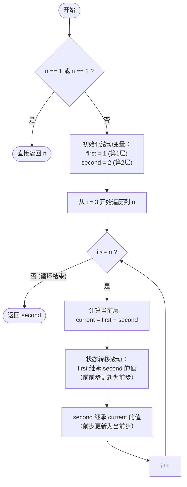

# LeetCode 70 - 爬楼梯 (Climbing Stairs) 详解

## 题目描述

假设你正在爬楼梯。需要 `n` 阶你才能到达楼顶。

每次你可以爬 `1` 或 `2` 个台阶。你有多少种不同的方法可以爬到楼顶呢？

**示例 1：**
输入：`n = 2`
输出：`2`
解释：有两种方法可以爬到楼顶：1. 1 阶 + 1 阶； 2. 2 阶。

**示例 2：**
输入：`n = 3`
输出：`3`
解释：有三种方法可以爬到楼顶：1. 1 阶 + 1 阶 + 1 阶； 2. 1 阶 + 2 阶； 3. 2 阶 + 1 阶。

---

## 解法分析：动态规划 (斐波那契数列)

### 核心思维
为什么这是一道经典的动态规划题？
假设你要爬到第 10 层楼，你最后一步是怎么上去的？
只有两种可能：
1. 从第 9 层跨了 **1 步**上来的。
2. 从第 8 层跨了 **2 步**上来的。

这意味着：**爬到第 10 层的方法总数 = 爬到第 9 层的方法总数 + 爬到第 8 层的方法总数**。
这就是著名的状态转移方程：`f(n) = f(n-1) + f(n-2)`。这实际上就是斐波那契数列（Fibonacci sequence）。

---

## 你的代码包含三种进阶解法

| 解法 | 策略 | 时间复杂度 | 空间复杂度 | 评析 |
|------|------|-----------|-----------|------|
| `climbStairs` | 纯递归 | O(2ⁿ) 💥 | O(n) | **强烈不推荐**，包含海量重复计算，必定超时 |
| `climbStairs2` | 动态规划 (一维数组) | O(n) | O(n) | 推荐，思路最清晰的基础写法 |
| `climbStairs3` | 动态规划 (滚动变量) | O(n) | **O(1)** | **最优解**，极致优化了空间 |

---

## 解法一：纯递归 (超时风险)

```java
// ❌ 极其不推荐的代码（仅作思维展示）
public int climbStairs(int n){
    // 递归终止条件 (Base Case)
    if (n == 1) return 1;
    if (n == 2) return 2;

    // 递归公式 f(n) = f(n-1) + f(n-2)
    // 致命缺点：会有极其严重的重复计算
    return climbStairs(n - 1) + climbStairs(n - 2);
}
```

**为什么会超时？**
计算 `f(5)` 需要算 `f(4)` 和 `f(3)`。
计算 `f(4)` 又需要算 `f(3)` 和 `f(2)`。
你看，`f(3)` 被计算了两次！如果是 `f(50)`，像 `f(10)` 这样的子问题会被重复计算成千上万次，导致程序卡死。

---

## 解法二：动态规划 / 备忘录数组 O(n)

为了解决重复计算，我们用一个数组 `dp` 把算过的结果**存起来**。从小到大顺着推。

```java
public int climbStairs2(int n){
    // 1. 处理特殊情况
    if(n == 1) return 1;

    // 2. 创建 dp 数组
    // 大小设为 n + 1 是为了让下标直接对应层数（dp[3] 就是第3层），方便理解
    int[] dp = new int[n + 1];

    // 3. 初始化基础值 (Base Case)
    dp[1] = 1;
    dp[2] = 2;

    // 4. 从第3层开始往上"填表"
    for(int i = 3; i <= n; i++){
        dp[i] = dp[i-1] + dp[i-2];
    }

    // 5. 返回第 n 层的结果
    return dp[n];
}
```

---

## 解法三：滚动变量优化空间变 O(1) (最优解)

**核心洞察：**
我们在填 `dp` 数组时，比如算 `dp[5]`，其实只需要用到 `dp[4]` 和 `dp[3]`。在这个时候，`dp[1]` 和 `dp[2]` 已经彻底没用了。
所以，**我们根本不需要一个长达 n 的数组，只需要两个变量**来记住“前一步”和“前前一步”即可！

```java
public int climbStairs3(int n){
    // 1. 处理特殊情况
    if(n == 1) return 1;
    if(n == 2) return 2;

    // 2. 定义两个变量 分别代表前前一步和前一步
    int first = 1;   // 相当于 dp[1]
    int second = 2;  // 相当于 dp[2]

    // 3. 从第三层开始迭代
    for(int i = 3; i <= n; i++){
        // 算出当前层
        int current = first + second;

        // 4. 滚动更新（关键一步！）
        first = second;    // 原来的前一步，变成了下次的前前一步
        second = current;  // 当前这一步，变成了下次的前一步
    }
    
    // 循环结束时，second 存的就是最后一步 f(n) 的结果
    return second;
}
```

---

## 示例详细推演 (以最优解解法三计算 n=5 为例)

假如要爬 `n = 5` 层楼梯。初始化 `first = 1`，`second = 2`。

### 第 1 轮循环：计算第 3 层 (`i = 3`)
- 当前层：`current = first(1) + second(2) = 3`
- 滚动更新准备下一次：
  - `first` 变成老 `second` = `2`
  - `second` 变成老 `current` = `3`
*(现在 `first` 是第 2 层，`second` 是第 3 层)*

### 第 2 轮循环：计算第 4 层 (`i = 4`)
- 当前层：`current = first(2) + second(3) = 5`
- 滚动更新准备下一次：
  - `first` 变成老 `second` = `3`
  - `second` 变成老 `current` = `5`
*(现在 `first` 是第 3 层，`second` 是第 4 层)*

### 第 3 轮循环：计算第 5 层 (`i = 5`)
- 当前层：`current = first(3) + second(5) = 8`
- 滚动更新准备下一次：
  - `first` 变成老 `second` = `5`
  - `second` 变成老 `current` = `8`
*(现在 `first` 是第 4 层，`second` 是第 5 层)*

循环结束 (`i > 5`)，最终返回 `second` 的值 **8**。**推演正确！**

---

## 核心流程图 (滚动变量状态转移)


