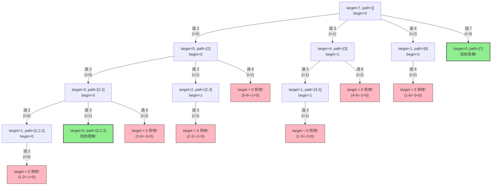
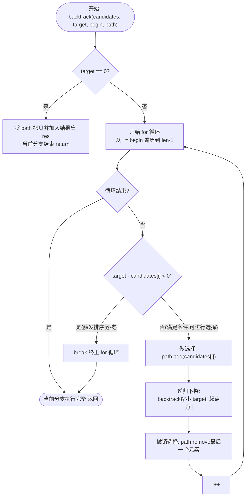

# 39. 组合总和 (Combination Sum) - 回溯算法详解

## 1. 算法分析方法
此问题属于经典的**组合型回溯（Backtracking）**无重复组合问题。由于题目规定：**同一个数字可以无限制重复被选取**，且**结果中不考虑数字的顺序**（即 `[2,2,3]` 和 `[3,2,2]` 视为同一个组合，不应重复计算），我们在搜索时的核心策略是：
1. **统一寻找策略（避免排列重复）**：设定一个游标 `begin`，每次我们向后搜索或深入下一层树分支时，只能从 `begin` 下标或它之后的数字里面选。由于限制了选择范围不往回走，因此不会出现 `先选3再选2` 的情况，从而完美解决重复问题。
2. **排序剪枝（提高效率）**：先将所有的候选数组从小到大排序。如果在搜索某条路径时发现当前的数值 `candidates[i]` 已经大于剩余需要凑出的数值 `target`，那么排在 `candidates[i]` 后面的数字肯定更大于 `target`，此时就可以直接 `break` 终止当前层的循环（剪枝操作），不再往深处走无用功。

## 2. 状态转移定义与推导
虽然严格来说这属于回溯/DFS，但我们可以参考动态规划思想对树的状态进行定义：
设当前状态表示为 `F(target, begin)`：
- **`target`**：表示**当前还需要凑出的目标和**。
- **`begin`**：表示**当前这一轮及后代搜索允许的起始下标范围**。

其状态转移逻辑（即如何分裂出下一层子树的状态）如下：
- **边界状态（终止条件）**：
  若 `target == 0`，说明此前的路径上的数字总和已刚好凑出了初始的 `target`。将当前合法路径加入最终的结果集，并返回。
  如果 `target - candidates[i] < 0`，因为数组已排序，此时触发剪枝条件阻断状态蔓延。
- **状态转移（分支扩展）**：
  对于所有满足 `i ∈ [begin, candidates.length - 1]` 并且 `target - candidates[i] >= 0` 的候选数字，可以选择将其放入临时路径中并步入下一个状态：
  `F(target, begin) ——选 candidates[i]——> F(target - candidates[i], i)`
  注意：由于题目允许数字被重复选用，这里进入下一层时允许的起始游标依然是 `i`，而不是 `i + 1`！

## 3. 详细示例推演
以 **输入**：`candidates = [2,3,6,7]`, `target = 7` 为例。
**前置准备**：排序后数组为 `[2,3,6,7]`。
开始运行 `backtrack(target=7, begin=0, path=[])`，下文树形展开推演：

- **第一层**：`target=7, begin=0`
  - 选 `i=0`元素 `2`：`path=[2]`，目标变为 `7-2=5`。递归进入下一层：
    - **第二层**：`target=5, begin=0`
      - 选 `i=0`元素 `2`：`path=[2,2]`，目标变为 `5-2=3`。递归进入：
        - **第三层**：`target=3, begin=0`
          - 选 `i=0`元素 `2`：`path=[2,2,2]`，目标 `3-2=1`。递归：
            - **第四层**：`target=1, begin=0`
              - 选 `i=0`元素 `2`：测试 `1-2 = -1 < 0`，触发**剪枝** ✂️，`break`。
          - 撤销 `2`，`path` 变回 `[2,2]`。
          - 选 `i=1`元素 `3`：`path=[2,2,3]`，目标 `3-3=0`。递归：
            - **第四层**：发现 `target=0`，**找到一个答案 `[2,2,3]`**，加入结果集！返回。
          - 撤销 `3`，`path`变回 `[2,2]`。
          - 选 `i=2`元素 `6`：`3-6 = -3 < 0`，触发**剪枝** ✂️，`break`。
      - 撤销 `2`，`path` 变回 `[2]`。
      - 选 `i=1`元素 `3`：`path=[2,3]`，目标变为 `5-3=2`。递归进入：
        - **第三层**：`target=2, begin=1`
          - 选 `i=1`元素 `3`：测试 `2-3 = -1 < 0`，触发**剪枝** ✂️，`break`。
      - 撤销 `3`，`path`变回 `[2]`。
      - 选 `i=2`元素 `6`：测试 `5-6 = -1 < 0`，触发**剪枝** ✂️，`break`。
  - 撤销 `2`，第一层 `path` 变回 `[]`。
  - 选 `i=1`元素 `3`：`path=[3]`，目标变为 `7-3=4`。递归进入下一层：
    - **第二层**：`target=4, begin=1` 
      - (注意 `begin=1`，这一层不再考虑前方的元素 `2`)
      - 选 `i=1`元素 `3`：`path=[3,3]`，目标 `4-3=1`。递归：
        - **第三层**：`target=1, begin=1`
          - 选 `i=1`元素 `3`，`1-3 < 0`，**剪枝**✂️，`break`。
      - 撤销 `3`，`path` 变回 `[3]`。
      - 选 `i=2`元素 `6`，`4-6 < 0`，**剪枝**✂️，`break`。
  - 撤销 `3`，第一层 `path` 变回 `[]`。
  - 选 `i=2`元素 `6`：`path=[6]`，目标变为 `7-6=1`。递归下一层：
    - **第二层**：`target=1, begin=2`
      - 选 `i=2`元素 `6`，`1-6 < 0`，**剪枝**✂️，`break`。
  - 撤销 `6`，第一层 `path` 变回 `[]`。
  - 选 `i=3`元素 `7`：`path=[7]`，目标 `7-7=0`。递归下一层：
    - **第二层**：发现 `target==0`，**找到另一个答案 `[7]`**，加入结果集！
  - 撤销 `7`，循环彻底执行完毕。搜索终止。

**最终结果集合**：`[[2,2,3], [7]]`

**示例回溯树状流程图**：


## 4. 具体代码
```java
import java.util.ArrayList;
import java.util.Arrays;
import java.util.List;

public class combinationSum39 {
    public List<List<Integer>> combinationSum(int[] candidates,int target){
        List<List<Integer>> res=new ArrayList<>();

        //1.排序是剪枝的前提 能大幅提升效率
        Arrays.sort(candidates);

        //2.开始回溯
        // 参数：候选数组, 目标剩下多少, 当前路径的开始下标, 当前路径列表, 结果集
        backtrack(candidates, target, 0, new ArrayList<>(), res);

        return res;

    }

    /**
     * 回溯函数
     * @param candidates 候选数组
     * @param target     当前还需要凑多少钱 (target - sum)
     * @param begin      下一轮搜索的起点 (防止重复)
     * @param path       当前已经选了哪些数 (路径)
     * @param res        结果集
     */
    private void backtrack(int[] candidates, int target, int begin, List<Integer> path, List<List<Integer>> res){
        // --- 终止条件 ---

        // 1. 如果target刚好减到0 说明凑出来了，存入结果集并返回
        if(target==0){
            res.add(new ArrayList<>(path));
            return;
        }

        // --- 选择列表 ---
        for(int i=begin;i<candidates.length;i++){
            // 剪枝：因已排序，如果当前数字已经比剩下的 target 大了，后面的数字也必然大于
            if(target-candidates[i]<0){
                break;
            }

            //1. 做选择：尝试把当前数字加入路径
            path.add(candidates[i]);

            //2. 递归进入下一层
            // 注意：因为可以重复使用，所以下一轮的起点还是 i，而不是 i + 1
            // 下一层目标值缩减为 target - candidates[i]
            backtrack(candidates, target - candidates[i], i, path, res);

            // 3. 撤销选择 (回溯的核心)
            // 归还当前数字的"存在空间"，给其他同一层的兄弟候选元素留下无污染的 path。
            path.remove(path.size() - 1);
        }
    }
}
```

## 5. 核心流程图


