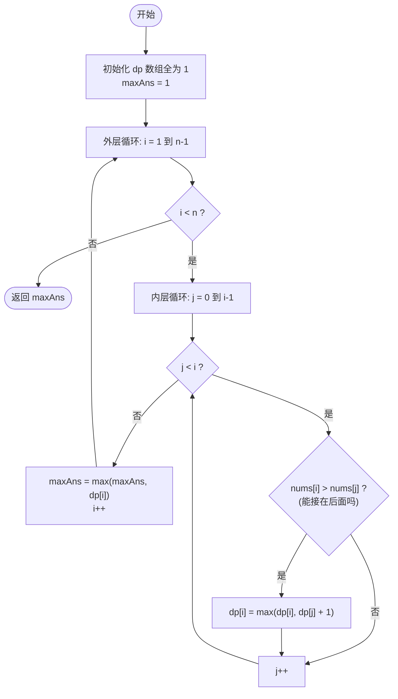
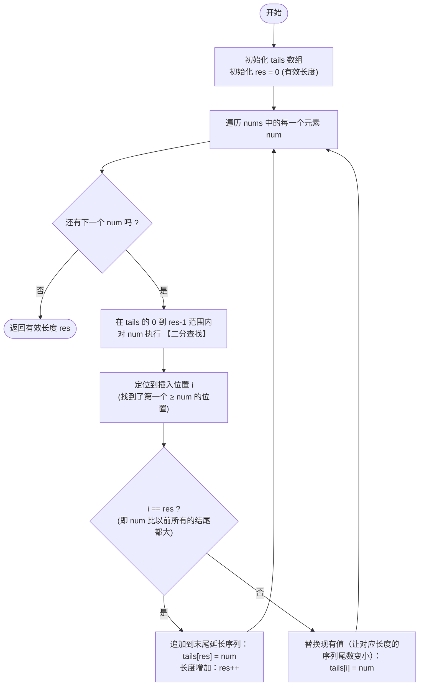

# LeetCode 300 - 最长递增子序列 (Longest Increasing Subsequence) 详解

## 题目描述

给你一个整数数组 `nums` ，找到其中最长严格递增子序列的长度。

**子序列** 是由数组派生而来的序列，删除（或不删除）数组中的元素而不改变其余元素的顺序。例如，`[3,6,2,7]` 是数组 `[0,3,1,6,2,2,7]` 的子序列。

**示例：**
输入：`nums = [10,9,2,5,3,7,101,18]`
输出：`4`
解释：最长递增子序列是 `[2,3,7,101]`，因此长度为 `4`。

---

## 1. 解法一：动态规划 O(n²)

### 1.1 分析方法与状态转移方程推导
求“最长递增子序列”是算法中极具代表性的动态规划问题。可以这样思考：

**状态定义：** 设 `dp[i]` 表示**以 `nums[i]` 这个数结尾**的最长递增子序列的长度。
**初始化：** 因为每个数字如果谁都不接，最起码它可以自己单独构成一个长度为 `1` 的子序列。所以初始条件是：所有 `dp[i] = 1`。

**推导状态转移方程：**
假设我们现在要计算 `dp[i]`，既然要求子序列是**严格递增**的，我们就回头遍历前面 `0` 到 `i-1` 的所有元素（设索引为 `j`）：
- 如果 `nums[i] > nums[j]`，这就说明当前的 `nums[i]` 可以安全地“接在” `nums[j]` 的最长子序列后面。
- 接上去之后，新的序列长度就变成了 `dp[j] + 1`。
- 因为前面可能有好多个满条件的 `j`，我们要挑一个能让最终长度最长的那个接上去。
所以得出状态转移方程：
**`dp[i] = max(dp[i], dp[j] + 1)`** （条件是 `0 <= j < i` 且 `nums[i] > nums[j]`）

### 1.2 核心代码 (解法一)
```java
public int lengthOfLIS(int[] nums){
    int n = nums.length;
    if(n == 0) return 0;

    // dp[i]表示以nums[i]结尾的最长递增子序列长度
    int[] dp = new int[n];
    // 初始化 每个数字本身至少可以构成长度为1的子序列
    Arrays.fill(dp, 1);

    int maxAns = 1;

    for(int i = 1; i < n; i++){
        // 往回找 看看能接在谁后面
        for(int j = 0; j < i; j++){
            if(nums[i] > nums[j]){
                // 如果能接上，就尝试更新最大值
                dp[i] = Math.max(dp[i], dp[j] + 1);
            }
        }
        // 记录全局最大值
        maxAns = Math.max(maxAns, dp[i]);
    }
    return maxAns;
}
```

### 1.3 示例详细推演 (解法一：动态规划)
以 `nums = [10, 9, 2, 5, 3, 7]` 为例：
初始 `dp = [1, 1, 1, 1, 1, 1]`

- **i = 0 (`nums[0]=10`)**: `dp[0] = 1`。全局 `max = 1`。
- **i = 1 (`nums[1]=9`)**: `j=0` 时，`9 < 10` 接不上。`dp[1] = 1`。全局 `max = 1`。
- **i = 2 (`nums[2]=2`)**: 分别看 10 和 9，都比 2 大，接不上。`dp[2] = 1`。全局 `max = 1`。
- **i = 3 (`nums[3]=5`)**: 
  - `j=0` (10)：接不上
  - `j=1` (9)：接不上
  - `j=2` (2)：`5 > 2`，可以接。`dp[3] = max(1, dp[2]+1) = 2`。
  全局 `max = 2`。 此时 `dp = [1, 1, 1, 2, 1, 1]`
- **i = 4 (`nums[4]=3`)**: 
  - 只有 `j=2` (2) 能接上。`dp[4] = max(1, dp[2]+1) = 2`。
  全局 `max = 2`。 此时 `dp = [1, 1, 1, 2, 2, 1]`
- **i = 5 (`nums[5]=7`)**: 
  - 能接在 `j=2(2)` 后面：`dp[5] = dp[2]+1 = 2`
  - 能接在 `j=3(5)` 后面：`dp[5] = dp[3]+1 = 3`
  - 能接在 `j=4(3)` 后面：`dp[5] = max(3, dp[4]+1) = 3`
  取最大值为 3。 全局 `max = 3`。
结果返回 **3**。

### 1.4 核心流程图 (解法一：动态规划)


---

## 2. 解法二：贪心 + 二分查找 O(n log n) 🏆 最优解

### 2.1 分析方法
我们要想让一个**递增子序列尽可能地长**，就应该让这个子序列**上升得越慢越好**（换句话说，每次加进来的数字尽可能小），这样后面才能留出更多的空间给其他数字。

基于这个核心思想，我们建立一个辅助数组 `tails`：
**`tails[i]` 存储的是：长度为 `i+1` 的所有递增子序列中，末尾数最小的那一个。**

遍历每一个数 `num`：
1. 如果 `num` 比 `tails` 里所有数都大：说明我们可以把这个数接在最后面，使得最长递增子序列的长度 `+1`。
2. 否则，我们在已经完全单调递增的 `tails` 数组里，使用 **二分查找** 找到**第一个大于等于 `num` 的数**，并用 `num` 去**替换**它。
*(替换的意义：我们在维持同样长度的序列时，强行把它的结尾数字变得更小了，相当于削平了山头，这有利于后续接盘更多的数。)*

### 2.2 核心代码 (解法二)
```java
public int lengthOfLIS2(int[] nums){
    // tails[i]存储的长度为i+1的递增子序列的最小末尾值
    int[] tails = new int[nums.length];
    // res是当前tails数组的有效长度，也是目前找到的最长子序列长度
    int res = 0;

    for(int num : nums){
        // 二分查找 在tails[0...res-1]中找第一个>=num的位置
        int i = 0, j = res;
        while(i < j){
            int mid = i + (j - i) / 2;
            if(tails[mid] < num){
                i = mid + 1;
            }else{
                j = mid;
            }
        }

        // 如果i==res，说明num比tails里的所有数都大
        // 这是一个新的最长序列的结尾
        if(i == res){
            tails[res] = num;
            res++;
        }else{
            // 否则，用num替换掉tails[i]
            // 含义：长度为i+1的子序列，现在有了一个更小的结尾num！上升得更慢了！
            tails[i] = num;
        }
    }
    return res;
}
```

### 2.3 示例详细推演 (解法二：贪心+二分)
依然以 `nums = [10, 9, 2, 5, 3, 7]` 为例：
初始化 `tails = []`，最长长度 `res = 0`。

- **遍历第 1 个数：10**
  在空 `tails` 查找，`i = 0 == res`，直接加入：`tails[0] = 10`, `res = 1`。
  👉 `tails` = **`[10]`** （长度为1的最轻尾部是10）

- **遍历第 2 个数：9**
  在 `[10]` 中二分找第一个 `≥ 9` 的数，找到 `10`。
  替换之：`tails[0] = 9`。
  *(潜台词：长度1的序列，用9结尾比用10更有前途。)*
  👉 `tails` = **`[9]`**

- **遍历第 3 个数：2**
  在 `[9]` 中找 `≥ 2` 的数，找到 `9`。
  替换之：`tails[0] = 2`。
  👉 `tails` = **`[2]`**

- **遍历第 4 个数：5**
  在 `[2]` 中找 `≥ 5` 的数。找不到(因为它比 2 大)。
  所以 `i = 1 == res`，可以放心追加：`tails[1] = 5`, `res = 2`。
  👉 `tails` = **`[2, 5]`** （目前最长为2）

- **遍历第 5 个数：3**
  在 `[2, 5]` 中找 `≥ 3` 的数。找到位置 `1` (数字5)。
  替换它：`tails[1] = 3`。
  *(潜台词：长度2的序列原来是 [2,5]，现在变成了结尾更小的 [2,3]，太棒了！)*
  👉 `tails` = **`[2, 3]`**

- **遍历第 6 个数：7**
  在 `[2, 3]` 中找 `≥ 7` 的数。找不到，比 3 大。
  追加：`tails[2] = 7`, `res = 3`。
  👉 `tails` = **`[2, 3, 7]`**

最终 `res = 3`，最长递增子序列长度为 **3**。完美！

### 2.4 核心流程图 (解法二：贪心+二分)

