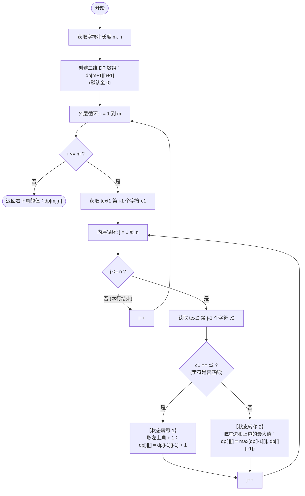

# LeetCode 1143 - 最长公共子序列 (Longest Common Subsequence) 详解

## 题目描述

给定两个字符串 `text1` 和 `text2`，返回这两个字符串的最长 **公共子序列** 的长度。如果不存在 **公共子序列** ，返回 `0` 。

一个字符串的 **子序列** 是指这样一个新的字符串：它是由原字符串在不改变字符的相对顺序的情况下删除某些字符（也可以不删除任何字符）后组成的新字符串。
- 例如，`"ace"` 是 `"abcde"` 的子序列，但 `"aec"` 不是 `"abcde"` 的子序列。

两个字符串的 **公共子序列** 是这两个字符串所共同拥有的子序列。

**示例：**
输入：`text1 = "abcde", text2 = "ace"` 
输出：`3`  
解释：最长公共子序列是 `"ace"` ，它的长度为 3 。

---

## 1. 解法一：二维动态规划 O(m*n)

### 1.1 分析方法与状态转移方程推导
求解两个字符串的子序列（或子串）问题，最经典的思路是构造一个**二维网格（二维 DP 数组）**，比较它们每一个字符的匹配情况。

**状态定义：**
设 `dp[i][j]` 表示：字符串 `text1` 的前 `i` 个字符（即 `text1[0...i-1]`）和字符串 `text2` 的前 `j` 个字符（即 `text2[0...j-1]`）的**最长公共子序列的长度**。

*(注意：为什么要定义成前 `i` 和前 `j` 个字符，而不是直接用索引？因为空字符串的长度是 0，加上一行一列用来表示空串，可以极大地简化边界情况的处理，避免出现 `i-1` 下标越界的问题)*

**推导状态转移方程：**
当我们考察 `text1` 的第 `i` 个字符（设为 `c1`）和 `text2` 的第 `j` 个字符（设为 `c2`）时，只会有两种情况：

- **情况 1：`c1 == c2` (两个字符相同)**
  既然这两个字符长得一样，它们必定可以共同加入到“最长公共子序列”的末尾中！
  那么当前的长度，就等于它们**加入之前**的长度 `+ 1`。
  它们加入之前的状态是什么？就是 `text1` 的前 `i-1` 个字符，和 `text2` 的前 `j-1` 个字符匹配的最大长度，对应二维表里的**左上角**。
  👉 **`dp[i][j] = dp[i-1][j-1] + 1`**

- **情况 2：`c1 != c2` (两个字符不同)**
  既然这两个字符不同，它们就不可能同时出现在最长公共子序列的末尾。
  这就意味着，拿 `c1` 去匹配 `text2` 的前 `j-1` 个字符，或者拿 `c2` 去匹配 `text1` 的前 `i-1` 个字符，这两种选择中，肯定有一个能提供当前的最优解。
  对应到二维表中，就是取**上方**和**左方**的最大值。
  👉 **`dp[i][j] = max(dp[i-1][j], dp[i][j-1])`**

**初始化：**
`dp[0][j]` 意味着 `text1` 是空串，空串和任何字符串的公共子序列都是 0。
`dp[i][0]` 同理。
Java 新建 `int[][]` 数组时默认全为 0，所以无需刻意初始化边界。

### 1.2 核心代码
```java
public class longestCommonSubsequence1143 {
    public int longestCommonSubsequence(String text1, String text2){
        int m = text1.length();
        int n = text2.length();

        // dp[i][j]表示text[0...i-1]和text2[0...j-1] 的 LCS 长度
        // 多一行一列是为了处理空串的情况，且避免下标越界
        int[][] dp = new int[m + 1][n + 1];

        // 默认第0行和第0列全部为0（Java数组初始化自带特性）

        for(int i = 1; i <= m; i++){
            // 获取text1的当前字符(注意字符串下标是从0开始的，所以是 i-1)
            char c1 = text1.charAt(i - 1);

            for(int j = 1; j <= n; j++){
                // 获取text2的当前字符
                char c2 = text2.charAt(j - 1);

                if(c1 == c2){
                    // 状态转移1：字符相同 -> 取左上角的值 + 1
                    dp[i][j] = dp[i - 1][j - 1] + 1;
                }else{
                    // 状态转移2：字符不同 -> 取左边或上边的最大值
                    dp[i][j] = Math.max(dp[i - 1][j], dp[i][j - 1]);
                }
            }
        }
        // 右下角的终点就是整个字符串匹配的答案
        return dp[m][n];
    }
}
```

### 1.3 示例详细推演
以 `text1 = "abc"`, `text2 = "ahc"` 为例。
`m = 3`, `n = 3`。`dp` 数组大小为 `4 x 4`。

**初始状态（包含空串的第 0 行第 0 列）：**
```text
      Ø   a   h   c  (text2)
  Ø   0   0   0   0
  a   0   0   0   0
  b   0   0   0   0
  c   0   0   0   0
(text1)
```

**第 1 轮外循环 (i=1, 字符为 'a'):**
- `j=1 ('a')`: `'a' == 'a'`。`dp[1][1] = dp[0][0] + 1 = 0 + 1 = 1`。
- `j=2 ('h')`: `'a' != 'h'`。`dp[1][2] = max(dp[0][2], dp[1][1]) = max(0, 1) = 1`。
- `j=3 ('c')`: `'a' != 'c'`。`dp[1][3] = max(0, 1) = 1`。
```text
  当前阵列结果:
  Ø: 0 0 0 0
  a: 0 1 1 1
```

**第 2 轮外循环 (i=2, 字符为 'b'):**
- `j=1 ('a')`: `'b' != 'a'`。`dp[2][1] = max(dp[1][1], dp[2][0]) = max(1, 0) = 1`。
- `j=2 ('h')`: `'b' != 'h'`。`dp[2][2] = max(dp[1][2], dp[2][1]) = max(1, 1) = 1`。
- `j=3 ('c')`: `'b' != 'c'`。`dp[2][3] = max(1, 1) = 1`。
```text
  当前阵列结果:
  Ø: 0 0 0 0
  a: 0 1 1 1
  b: 0 1 1 1
```

**第 3 轮外循环 (i=3, 字符为 'c'):**
- `j=1 ('a')`: `'c' != 'a'`。`dp[3][1] = max(dp[2][1], dp[3][0]) = max(1, 0) = 1`。
- `j=2 ('h')`: `'c' != 'h'`。`dp[3][2] = max(1, 1) = 1`。
- `j=3 ('c')`: `'c' == 'c'`！字符匹配。取左上角 `dp[2][2] + 1` = `1 + 1 = 2`。
```text
  最终完成矩阵:
      Ø   a   h   c
  Ø   0   0   0   0
  a   0   1   1   1
  b   0   1   1   1
  c   0   1   1   2  <-- 结果在这里
```
最终返回右下角的值 `dp[3][3] = 2`。推演正确。

### 1.4 核心流程图 (二维 DP)

