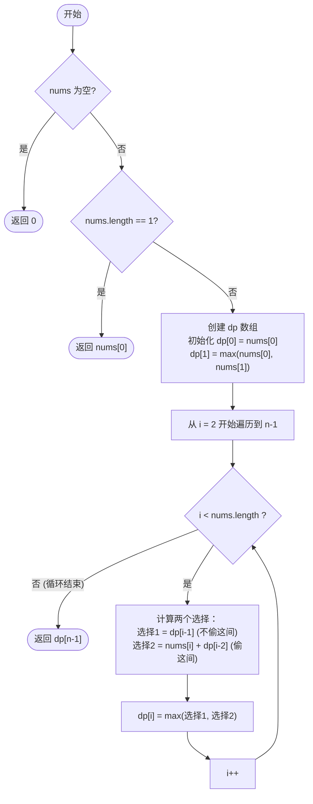

# LeetCode 198 - 打家劫舍 (House Robber) 详解

## 题目描述

你是一个专业的小偷，计划偷窃沿街的房屋。每间房内都藏有一定的现金，影响你偷窃的唯一制约因素就是相邻的房屋装有相互连通的防盗系统，**如果两间相邻的房屋在同一晚上被小偷闯入，系统会自动报警**。

给定一个代表每间房屋存放金额的非负整数数组，计算你 **不触动警报装置的情况下**，一夜之内能够偷窃到的最高金额。

**示例 1：**
输入：`nums = [1,2,3,1]`
输出：`4`
解释：偷窃第 1 号房屋（金额 = 1），然后偷窃第 3 号房屋（金额 = 3）。偷窃到的最高金额 = 1 + 3 = 4。

**示例 2：**
输入：`nums = [2,7,9,3,1]`
输出：`12`
解释：偷窃第 1 号房屋（金额 = 2），偷窃第 3 号房屋（金额 = 9），然后偷窃第 5 号房屋（金额 = 1）。偷窃到的最高金额 = 2 + 9 + 1 = 12。

---

## 解法分析：动态规划

### 核心思维

为什么这是一道经典的动态规划题？

假设你站在第 `i` 号房子前面，你只有两种选择：
1. **不偷这间房子**：那么你能拿到的最高金额 = 偷到第 `i-1` 号房子时的最高金额
2. **偷这间房子**：那么你**一定不能偷第 `i-1` 号房子**（相邻会报警），最高金额 = 这间房子的钱 + 偷到第 `i-2` 号房子时的最高金额

这就是状态转移方程的核心！

---

## 你的代码解法：标准动态规划 O(n) 空间

| 解法 | 策略 | 时间复杂度 | 空间复杂度 | 评析 |
|------|------|-----------|-----------|------|
| `rob` | 动态规划 (一维数组) | O(n) | O(n) | 推荐的标准写法，思路清晰 |

### 状态定义

`dp[i]` 表示：**偷到第 i 号房子时（下标从 0 开始），能拿到的最高金额**

注意：`dp[i]` **不代表一定要偷第 i 号房子**，而是表示"考虑到第 i 号房子为止"的最优解。

### 状态转移方程推导

对于第 `i` 号房子，有两种决策：

| 决策 | 操作 | 金额计算 |
|------|------|---------|
| 不偷第 i 号 | 继承前一间房子的最优解 | `dp[i-1]` |
| 偷第 i 号 | 拿这间的钱 + 前前一间的最优解 | `nums[i] + dp[i-2]` |

取两者的最大值：
```
dp[i] = max(dp[i-1], nums[i] + dp[i-2])
```

### 边界条件

- `dp[0]`：只有一间房子，必须偷它 → `dp[0] = nums[0]`
- `dp[1]`：有两间房子，偷金额大的那个 → `dp[1] = max(nums[0], nums[1])`

---

## 代码详解

```java
public class rob198 {
    public int rob(int[] nums){
        // 1. 处理边界条件
        if(nums==null||nums.length==0) return 0;  // 空数组
        if(nums.length==1) return nums[0];        // 只有一间房

        // 2. 定义dp数组
        // dp[i]表示 偷到第i间房子时，能拿到的最高金额
        int[] dp=new int[nums.length];

        // 3. 初始化基础状态
        dp[0]=nums[0];                           // 第一间：偷
        dp[1]=Math.max(nums[0],nums[1]);         // 第二间：选金额大的

        // 4. 状态转移
        for(int i=2;i<nums.length;i++){
            // 核心公式：要么不偷这间(继承前一间)，要么偷这间(拿这一间的钱 + 前前一间的总资产)
            dp[i]=Math.max(dp[i-1],nums[i]+dp[i-2]);
        }

        return dp[nums.length-1];
    }
}
```

---

## 示例详细推演

### 以 `nums = [2, 7, 9, 3, 1]` 为例

初始数组：`nums[0]=2, nums[1]=7, nums[2]=9, nums[3]=3, nums[4]=1`

#### 初始化阶段

```
dp[0] = nums[0] = 2
dp[1] = max(nums[0], nums[1]) = max(2, 7) = 7
```

此时 dp 数组：`[2, 7, ?, ?, ?]`

#### 第 1 轮循环：计算 dp[2] (i=2)

```
决策1：不偷第2号房子 → 继承 dp[1] = 7
决策2：偷第2号房子   → nums[2] + dp[0] = 9 + 2 = 11

dp[2] = max(7, 11) = 11
```

此时 dp 数组：`[2, 7, 11, ?, ?]`

**理解**：偷第0号和第2号（2+9=11）比只偷第1号（7）更划算

#### 第 2 轮循环：计算 dp[3] (i=3)

```
决策1：不偷第3号房子 → 继承 dp[2] = 11
决策2：偷第3号房子   → nums[3] + dp[1] = 3 + 7 = 10

dp[3] = max(11, 10) = 11
```

此时 dp 数组：`[2, 7, 11, 11, ?]`

**理解**：偷第3号房子（拿3块钱）+ 第1号房子（7块钱）= 10块，不如之前的方案（11块）

#### 第 3 轮循环：计算 dp[4] (i=4)

```
决策1：不偷第4号房子 → 继承 dp[3] = 11
决策2：偷第4号房子   → nums[4] + dp[2] = 1 + 11 = 12

dp[4] = max(11, 12) = 12
```

最终 dp 数组：`[2, 7, 11, 11, 12]`

**最终答案**：`dp[4] = 12`

**最优方案**：偷第0号(2) + 第2号(9) + 第4号(1) = 12

---

### 再以 `nums = [1, 2, 3, 1]` 为例

初始数组：`nums[0]=1, nums[1]=2, nums[2]=3, nums[3]=1`

#### 初始化阶段

```
dp[0] = nums[0] = 1
dp[1] = max(nums[0], nums[1]) = max(1, 2) = 2
```

此时 dp 数组：`[1, 2, ?, ?]`

#### 第 1 轮循环：计算 dp[2] (i=2)

```
决策1：不偷第2号房子 → 继承 dp[1] = 2
决策2：偷第2号房子   → nums[2] + dp[0] = 3 + 1 = 4

dp[2] = max(2, 4) = 4
```

此时 dp 数组：`[1, 2, 4, ?]`

#### 第 2 轮循环：计算 dp[3] (i=3)

```
决策1：不偷第3号房子 → 继承 dp[2] = 4
决策2：偷第3号房子   → nums[3] + dp[1] = 1 + 2 = 3

dp[3] = max(4, 3) = 4
```

最终 dp 数组：`[1, 2, 4, 4]`

**最终答案**：`dp[3] = 4`

**最优方案**：偷第0号(1) + 第2号(3) = 4

---

## 核心流程图



---

## DP 数组填充过程图解

以 `nums = [2, 7, 9, 3, 1]` 为例：

```
房子编号:    0      1      2      3      4
金额:       [2]    [7]    [9]    [3]    [1]
             ↓      ↓      ↓      ↓      ↓
dp数组:     [2]    [7]   [11]   [11]   [12]
             │      │      │      │      │
             │      │      │      │      └── max(11, 1+11) = 12
             │      │      │      └── max(11, 3+7) = 11
             │      │      └── max(7, 9+2) = 11
             │      └── max(2, 7) = 7
             └── 第一间必须偷
```

---

## 进阶优化：空间复杂度 O(1)

与爬楼梯类似，计算 `dp[i]` 时只需要 `dp[i-1]` 和 `dp[i-2]`，可以用滚动变量优化空间：

```java
public int robOptimized(int[] nums){
    if(nums==null||nums.length==0) return 0;
    if(nums.length==1) return nums[0];

    int prev2 = nums[0];                           // 相当于 dp[i-2]
    int prev1 = Math.max(nums[0], nums[1]);        // 相当于 dp[i-1]

    for(int i=2; i<nums.length; i++){
        int current = Math.max(prev1, nums[i]+prev2);
        prev2 = prev1;
        prev1 = current;
    }

    return prev1;
}
```

---

## 复杂度分析

| 指标 | 值 | 说明 |
|------|-----|------|
| 时间复杂度 | O(n) | 只需遍历一次数组 |
| 空间复杂度 | O(n) 或 O(1) | O(n) 用dp数组，O(1) 用滚动变量 |

---

## 关键要点总结

1. **状态定义**：`dp[i]` 表示考虑到第 i 号房子为止能偷到的最高金额
2. **核心方程**：`dp[i] = max(dp[i-1], nums[i] + dp[i-2])`
3. **边界处理**：`dp[0] = nums[0]`，`dp[1] = max(nums[0], nums[1])`
4. **优化空间**：可以用两个变量代替整个 dp 数组
