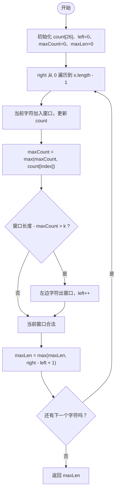

# LeetCode 424 - 替换后的最长重复字符

## 题目描述

给你一个仅由大写英文字母组成的字符串 `s` 和一个整数 `k`。你可以最多替换 `k` 次字符，每次可以把任意字符改成另一个大写英文字母。

请你返回执行上述操作后，所能得到的最长“只包含同一种字符”的子串长度。

示例：

- 输入：`s = "ABAB"`, `k = 2`
- 输出：`4`
- 解释：把两个 `A` 或两个 `B` 替换掉后，整个字符串都可以变成同一个字符。

---

## 1. 解法：滑动窗口 + 频次数组

### 1.1 方法分析

这段代码的目标，是维护一个“最多只需要替换 `k` 个字符就能变成同一种字符”的窗口。

窗口中如果想把所有字符都变成同一个字符，最省的做法一定是：

- 保留窗口内出现次数最多的那个字符。
- 把其他字符全部替换掉。

所以一个窗口是否有效，只取决于：

```text
窗口长度 - 窗口内出现次数最多的字符数量 <= k
```

也就是：

- `right - left + 1` 表示当前窗口长度。
- `maxCount` 表示当前窗口里某个字符出现的最高次数。
- 那么 `窗口长度 - maxCount` 就是“至少需要替换多少个字符”。

如果这个值大于 `k`，说明当前窗口不合法，必须缩小左边界。

### 1.2 变量含义

- `count[26]`：统计当前窗口内每个大写字母出现了多少次。
- `left`：窗口左边界。
- `right`：窗口右边界。
- `maxCount`：窗口遍历过程中，当前窗口内出现次数最多字符的次数。
- `maxLen`：满足条件的最大窗口长度。

### 1.3 为什么 `maxCount` 不回退也能成立

这道题里最容易疑惑的是：窗口缩小时，代码并没有重新计算 `maxCount`，为什么还能对？

原因是这份写法维护的是一个“历史最大值”。

```java
maxCount = Math.max(maxCount, count[index]);
```

它的作用不是精确表示“此刻窗口中的真实最大频次”，而是帮助我们判断窗口是否还有机会成为更长的合法窗口。

即使 `maxCount` 偶尔偏大，也只会让窗口缩小得稍微慢一点，但不会让最终答案变大错掉。因为：

- `right` 一直向右扩展。
- `left` 只会在必要时右移。
- `maxLen` 记录的是整个过程中出现过的最大合法窗口长度。

这是这道题常见的高效写法，时间复杂度可以保持 `O(n)`。

### 1.4 代码

```java
public class characterReplacement424 {
    public int characterReplace(String s,int k){
        // 用于记录窗口内每个字符出现的次数 (A-Z)
        int[] count=new int[26];

        int left=0;
        int maxCount=0; // 窗口内出现最多的字符的次数
        int maxLen=0; // 结果

        for(int right=0;right<s.length();right++){
            // 1. 右边字符进入窗口，更新计数
            int index=s.charAt(right)-'A';
            count[index]++;

            // 更新历史最大频次
            maxCount = Math.max(maxCount, count[index]);

            // 2. 如果窗口不合法，就移动左边界
            if(right-left+1-maxCount>k){
                count[s.charAt(left)-'A']--;
                left++;
            }

            // 3. 更新最大长度
            maxLen = Math.max(maxLen, right - left + 1);
        }
        return maxLen;
    }
}
```

### 1.5 示例详细推演

下面用经典示例 `s = "AABABBA"`, `k = 1` 来完整推演。

初始状态：

- `left = 0`
- `maxCount = 0`
- `maxLen = 0`
- `count` 全为 `0`

| 步骤 | `right` | 当前字符 | 主要计数变化 | `maxCount` | 当前窗口 | 窗口长度 | 需要替换数 | 是否缩窗 | `left` | `maxLen` |
| --- | --- | --- | --- | --- | --- | --- | --- | --- | --- | --- |
| 1 | 0 | `A` | `A:1` | 1 | `"A"` | 1 | `1-1=0` | 否 | 0 | 1 |
| 2 | 1 | `A` | `A:2` | 2 | `"AA"` | 2 | `2-2=0` | 否 | 0 | 2 |
| 3 | 2 | `B` | `B:1` | 2 | `"AAB"` | 3 | `3-2=1` | 否 | 0 | 3 |
| 4 | 3 | `A` | `A:3` | 3 | `"AABA"` | 4 | `4-3=1` | 否 | 0 | 4 |
| 5 | 4 | `B` | `B:2` | 3 | `"AABAB"` | 5 | `5-3=2` | 是 | 1 | 4 |
| 6 | 5 | `B` | `B:3` | 3 | `"ABABB"` | 5 | `5-3=2` | 是 | 2 | 4 |
| 7 | 6 | `A` | `A:2` | 3 | `"BABBA"` | 5 | `5-3=2` | 是 | 3 | 4 |

最终答案是 `4`。

### 1.6 第 5 步为什么要缩窗

在第 5 步时，窗口是 `"AABAB"`。

- 窗口长度是 `5`
- 出现次数最多的字符是 `A`，次数为 `3`
- 所以最少需要替换 `5 - 3 = 2` 个字符

但题目只允许替换 `1` 次，所以这个窗口已经不合法，必须左移 `left`。

### 1.7 第 6 步的关键理解

第 6 步后窗口看起来像 `"ABABB"`，此时：

- `B` 出现了 `3` 次
- 窗口长度是 `5`
- 仍然需要替换 `2` 次

依然大于 `k = 1`，所以继续缩窗。

这就是这道题的核心节奏：

- 右边扩张窗口
- 一旦超过允许替换数，就左边收缩窗口
- 整个过程中记录最大合法长度

### 1.8 复杂度分析

- 时间复杂度：`O(n)`  
  `right` 从左到右遍历一次，`left` 也只会单调右移一次。
- 空间复杂度：`O(1)`  
  只使用了长度固定为 `26` 的数组。

### 1.9 核心流程图



---

## 2. 总结

这道题本质上是在求一个最长窗口，使得窗口内除了出现次数最多的那个字符之外，其余字符总数不超过 `k`。

所以判断条件可以直接写成：

```text
窗口长度 - maxCount <= k
```

这也是这份代码能在线性时间内完成求解的原因。它不是暴力尝试替换，而是把“替换是否可行”转换成了一个窗口合法性判断问题。
