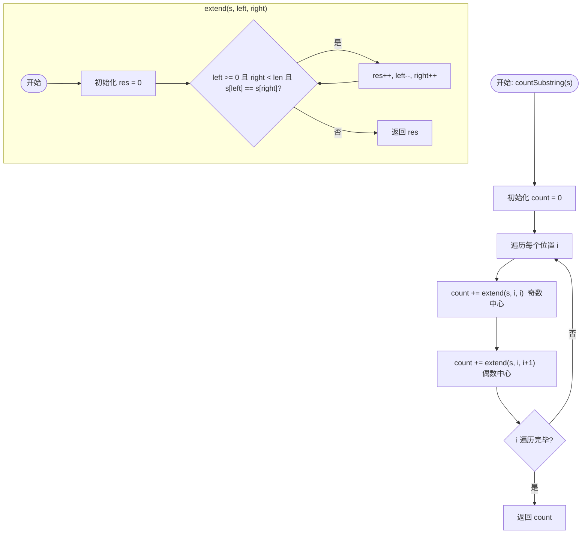

# 647. 回文子串 (Palindromic Substrings) - 详解

## 方法一：中心扩展法

### 1. 分析方法

核心思路：**以每个位置为中心向两边扩展，每成功扩展一次就发现一个回文子串**。与 LeetCode 5 类似，但目标不是找最长的，而是**统计所有回文子串的总数**。

关键：回文串分为奇数长度和偶数长度，需要两种中心形式：
- **奇数中心**：以单个字符 `(i, i)` 为中心扩展，如 `"a"`, `"aba"`, `"abcba"`。
- **偶数中心**：以两个相邻字符 `(i, i+1)` 为中心扩展，如 `"aa"`, `"abba"`。

**步骤**：
1. 初始化计数器 `count = 0`。
2. 遍历每个位置 `i`：
   - 以 `(i, i)` 为中心调用 `extend()`，累加返回的回文个数。
   - 以 `(i, i+1)` 为中心调用 `extend()`，累加返回的回文个数。
3. `extend(s, left, right)` 函数：当 `left` 和 `right` 没越界且 `s[left] == s[right]` 时，计数+1，继续左移 `left`、右移 `right`。
4. 返回总 `count`。

**时间复杂度**：O(n²)，每个中心最多扩展 O(n) 次。
**空间复杂度**：O(1)，只用了常数额外空间。

### 2. 详细示例推演

**输入**：`s = "aaa"`，长度 = 3

**初始**：`count = 0`

---

**i=0** (字符 `'a'`)：

**奇数扩展 `extend(s, 0, 0)`**：

| 步骤 | left | right | s[left] | s[right] | 匹配？ | 操作 |
|------|------|-------|---------|----------|--------|------|
| 1 | 0 | 0 | `'a'` | `'a'` | ✅ | res=1, left=-1, right=1 |
| 2 | -1 | 1 | 越界 | - | 停止 | 返回 res=1 |

找到回文：`"a"`

`count = 0 + 1 = 1`

**偶数扩展 `extend(s, 0, 1)`**：

| 步骤 | left | right | s[left] | s[right] | 匹配？ | 操作 |
|------|------|-------|---------|----------|--------|------|
| 1 | 0 | 1 | `'a'` | `'a'` | ✅ | res=1, left=-1, right=2 |
| 2 | -1 | 2 | 越界 | - | 停止 | 返回 res=1 |

找到回文：`"aa"`

`count = 1 + 1 = 2`

---

**i=1** (字符 `'a'`)：

**奇数扩展 `extend(s, 1, 1)`**：

| 步骤 | left | right | s[left] | s[right] | 匹配？ | 操作 |
|------|------|-------|---------|----------|--------|------|
| 1 | 1 | 1 | `'a'` | `'a'` | ✅ | res=1, left=0, right=2 |
| 2 | 0 | 2 | `'a'` | `'a'` | ✅ | res=2, left=-1, right=3 |
| 3 | -1 | 3 | 越界 | - | 停止 | 返回 res=2 |

找到回文：`"a"`, `"aaa"`

`count = 2 + 2 = 4`

**偶数扩展 `extend(s, 1, 2)`**：

| 步骤 | left | right | s[left] | s[right] | 匹配？ | 操作 |
|------|------|-------|---------|----------|--------|------|
| 1 | 1 | 2 | `'a'` | `'a'` | ✅ | res=1, left=0, right=3 |
| 2 | 0 | 3 | 越界(right) | - | 停止 | 返回 res=1 |

找到回文：`"aa"`

`count = 4 + 1 = 5`

---

**i=2** (字符 `'a'`)：

**奇数扩展 `extend(s, 2, 2)`**：

| 步骤 | left | right | s[left] | s[right] | 匹配？ | 操作 |
|------|------|-------|---------|----------|--------|------|
| 1 | 2 | 2 | `'a'` | `'a'` | ✅ | res=1, left=1, right=3 |
| 2 | 1 | 3 | 越界(right) | - | 停止 | 返回 res=1 |

找到回文：`"a"`

`count = 5 + 1 = 6`

**偶数扩展 `extend(s, 2, 3)`**：

| 步骤 | left | right | 说明 |
|------|------|-------|------|
| 1 | 2 | 3 | right=3 越界 → 直接返回 res=0 |

`count = 6 + 0 = 6`

---

**最终结果**：`count = 6` ✅

**汇总所有找到的回文子串**：

| 回文子串 | 起止索引 | 发现时机 |
|---------|---------|---------|
| `"a"` | [0,0] | i=0 奇数扩展 |
| `"aa"` | [0,1] | i=0 偶数扩展 |
| `"a"` | [1,1] | i=1 奇数扩展 |
| `"aaa"` | [0,2] | i=1 奇数扩展 |
| `"aa"` | [1,2] | i=1 偶数扩展 |
| `"a"` | [2,2] | i=2 奇数扩展 |

共 **6** 个回文子串。

---

**另一个示例推演**：`s = "abc"`

**i=0**：奇数 `extend(0,0)` → `"a"` (1)；偶数 `extend(0,1)` → `'a'!='b'` (0)
**i=1**：奇数 `extend(1,1)` → `"b"` (1)；偶数 `extend(1,2)` → `'b'!='c'` (0)
**i=2**：奇数 `extend(2,2)` → `"c"` (1)；偶数 `extend(2,3)` → 越界 (0)

总计：`count = 1+0+1+0+1+0 = 3` ✅（每个单字符本身就是回文）

### 3. 代码

```java
public int countSubstring(String s) {
    // 统计回文子串的总数
    int count = 0;

    for (int i = 0; i < s.length(); i++) {
        // 1. 奇数：以 i 为中心
        count += extend(s, i, i);

        // 2. 偶数：以 i 和 i+1 为中心
        count += extend(s, i, i + 1);
    }
    return count;
}

private int extend(String s, int left, int right) {
    int res = 0;
    // 当索引没越界，且左右字符相等时，说明找到了一个回文串
    while (left >= 0 && right < s.length() && s.charAt(left) == s.charAt(right)) {
        res++; // 计数器+1
        left--;
        right++;
    }
    return res;
}
```

### 4. 核心流程图



---

## 补充：与 LeetCode 5 的对比

| 维度 | LeetCode 5 (最长回文子串) | LeetCode 647 (回文子串计数) |
|------|------------------------|--------------------------|
| 目标 | 找最长的一个回文子串 | 统计所有回文子串的个数 |
| 扩展策略 | 同样使用中心扩展 | 同样使用中心扩展 |
| 关键区别 | 记录最长长度和起始位置 | 每次成功扩展就 `count++` |
| 时间复杂度 | O(n²) | O(n²) |
| 空间复杂度 | O(1) | O(1) |
