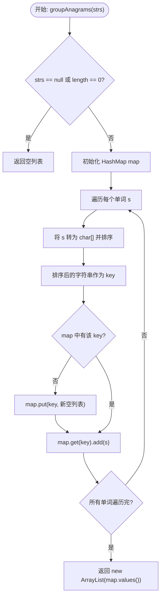
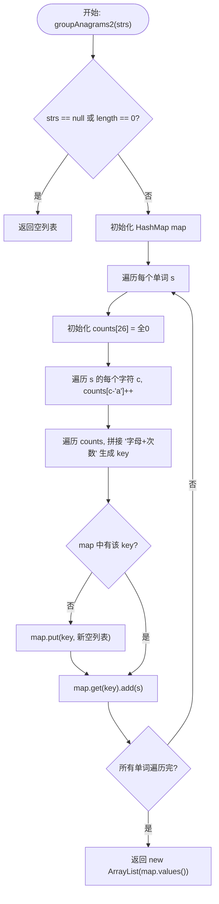

# 49. 字母异位词分组 (Group Anagrams) - 详解

## 方法一：排序法（Sorted Key）

### 1. 分析方法

核心思路：**互为异位词的单词，排序后一定完全相同**。利用排序后的字符串作为 HashMap 的 Key，把所有排序后相同的单词归为一组。

1. **空输入检查**：若 `strs` 为 `null` 或长度为 0，直接返回空列表。
2. **准备 HashMap**：`Map<String, List<String>>`，Key 为排序后的字符串，Value 为属于该组的所有原始单词列表。
3. **遍历每个单词**：
   - 将单词转为字符数组并排序，生成 Key。
   - 使用该 Key 查找 Map，若不存在则新建空列表。
   - 将原始单词加入对应列表。
4. **返回 Map 中所有 Value**，即所有分组的列表。

**时间复杂度**：O(n · k log k)，n 为单词个数，k 为单词最大长度（排序开销）。
**空间复杂度**：O(n · k)，存储所有单词。

### 2. 详细示例推演

**输入**：`strs = ["eat", "tea", "tan", "ate", "nat", "bat"]`

**Step 1 — 空输入检查**：`strs` 不为 `null` 且长度为 6，通过。

**Step 2 — 初始化 HashMap**：`map = {}`

**Step 3 — 逐词遍历**：

| 步骤 | 原始单词 | 排序后 Key | map 中有该 Key？ | 操作 | map 状态 |
|-----|---------|-----------|----------------|------|---------|
| 1 | `"eat"` | `"aet"` | 否 | 新建列表，加入 `"eat"` | `{"aet": ["eat"]}` |
| 2 | `"tea"` | `"aet"` | 是 | 加入 `"tea"` | `{"aet": ["eat", "tea"]}` |
| 3 | `"tan"` | `"ant"` | 否 | 新建列表，加入 `"tan"` | `{"aet": ["eat", "tea"], "ant": ["tan"]}` |
| 4 | `"ate"` | `"aet"` | 是 | 加入 `"ate"` | `{"aet": ["eat", "tea", "ate"], "ant": ["tan"]}` |
| 5 | `"nat"` | `"ant"` | 是 | 加入 `"nat"` | `{"aet": ["eat", "tea", "ate"], "ant": ["tan", "nat"]}` |
| 6 | `"bat"` | `"abt"` | 否 | 新建列表，加入 `"bat"` | `{"aet": ["eat", "tea", "ate"], "ant": ["tan", "nat"], "abt": ["bat"]}` |

**Step 4 — 返回所有 Value**：
```
[["eat", "tea", "ate"], ["tan", "nat"], ["bat"]]
```

✅ 异位词被正确分组。

### 3. 代码

```java
public List<List<String>> groupAnagrams(String[] strs) {
    // 1. 检查空输入
    if (strs == null || strs.length == 0) {
        return new ArrayList<>();
    }

    // 2. 准备哈希表 key: 排序后的 string  value: 所有单词 List<String>
    Map<String, List<String>> map = new HashMap<>();

    // 3. 遍历每个单词
    for (String s : strs) {
        // --- 生成 Key（排序）---
        char[] chars = s.toCharArray();
        Arrays.sort(chars);
        String key = new String(chars);

        // --- 放入 Map ---
        if (!map.containsKey(key)) {
            map.put(key, new ArrayList<>());
        }

        // 把原始的单词 s 加入对应的名单
        map.get(key).add(s);
    }

    // 4. 返回 Map 中所有的 value（所有分组的列表）
    return new ArrayList<>(map.values());
}
```

### 4. 核心流程图



---

## 方法二：字符计数法（Frequency Key）

### 1. 分析方法

核心思路：**避免排序**，改为统计每个单词中各字母的出现频率，再将频率信息拼成一个唯一的字符串作为 Key。

1. **空输入检查**：同方法一。
2. **准备 HashMap**。
3. **遍历每个单词**：
   - 用长度为 26 的 `int[]` 统计各字母频率。
   - 按顺序拼接 `字母+次数`（跳过次数为 0 的），生成唯一 Key。例如 `"aab"` → `"a2b1"`。
   - 用该 Key 归组。
4. **返回所有分组**。

**时间复杂度**：O(n · k)，n 为单词个数，k 为单词最大长度（无排序开销）。
**空间复杂度**：O(n · k)。

### 2. 详细示例推演

**输入**：`strs = ["eat", "tea", "tan", "ate", "nat", "bat"]`

**逐词拼 Key 过程**：

| 单词 | counts 数组 (仅非零) | 拼接过程 | 生成 Key |
|------|---------------------|---------|---------|
| `"eat"` | `a:1, e:1, t:1` | `a1` + `e1` + `t1` | `"a1e1t1"` |
| `"tea"` | `a:1, e:1, t:1` | `a1` + `e1` + `t1` | `"a1e1t1"` |
| `"tan"` | `a:1, n:1, t:1` | `a1` + `n1` + `t1` | `"a1n1t1"` |
| `"ate"` | `a:1, e:1, t:1` | `a1` + `e1` + `t1` | `"a1e1t1"` |
| `"nat"` | `a:1, n:1, t:1` | `a1` + `n1` + `t1` | `"a1n1t1"` |
| `"bat"` | `a:1, b:1, t:1` | `a1` + `b1` + `t1` | `"a1b1t1"` |

**分组结果**：

| Key | 原始单词 |
|-----|---------|
| `"a1e1t1"` | `["eat", "tea", "ate"]` |
| `"a1n1t1"` | `["tan", "nat"]` |
| `"a1b1t1"` | `["bat"]` |

✅ 得到与方法一相同的分组结果，但避免了排序。

### 3. 代码

```java
public List<List<String>> groupAnagrams2(String[] strs) {
    // 1. 检查空输入
    if (strs == null || strs.length == 0) {
        return new ArrayList<>();
    }

    // 2. 准备哈希表
    Map<String, List<String>> map = new HashMap<>();

    for (String s : strs) {
        // --- 1. 统计词频 ---
        int[] counts = new int[26];
        for (char c : s.toCharArray()) {
            counts[c - 'a']++;
        }

        // --- 2. 生成唯一的 key ---
        // 把 counts 数组变成字符串
        // 例如 "aab" -> counts['a']=2, counts['b']=1 -> Key: "a2b1"
        StringBuilder sb = new StringBuilder();
        for (int i = 0; i < 26; i++) {
            if (counts[i] > 0) {
                sb.append((char) ('a' + i));
                sb.append(counts[i]);
            }
        }
        String key = sb.toString();

        // --- 3. 放入 map ---
        if (!map.containsKey(key)) {
            map.put(key, new ArrayList<>());
        }
        map.get(key).add(s);
    }
    return new ArrayList<>(map.values());
}
```

### 4. 核心流程图



---

## 两种方法对比

| 维度 | 方法一：排序法 | 方法二：字符计数法 |
|------|-------------|-----------------|
| Key 生成方式 | 对字符数组排序 | 统计字符频率拼接字符串 |
| 时间复杂度 | O(n · k log k) | O(n · k) |
| 空间复杂度 | O(n · k) | O(n · k) |
| 优势 | 实现简洁直观 | 避免排序，大 k 时更快 |
| 推荐场景 | 单词长度较短时 | 单词较长或追求极致性能时 |
