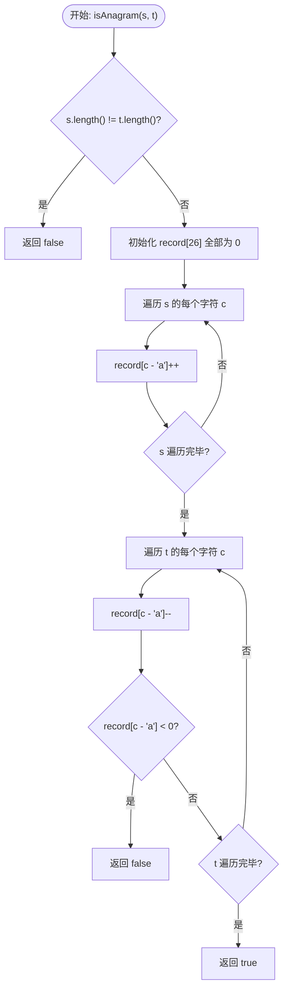
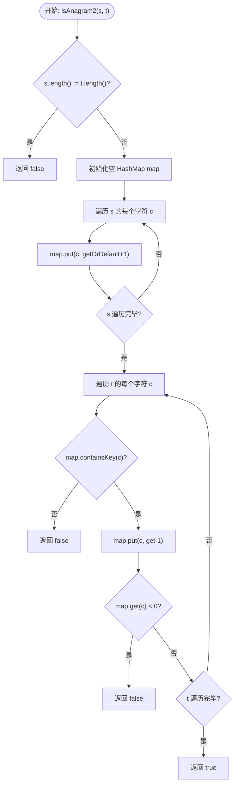

# 242. 有效的字母异位词 (Valid Anagram) - 详解

## 方法一：数组计数法（26 位字母表）

### 1. 分析方法

核心思路：**用一个长度为 26 的整型数组充当「账本」**，下标 `0~25` 分别对应字母 `a~z`。

1. **长度前置判断**：若 `s` 和 `t` 长度不等，直接返回 `false`——异位词字符数必然相同。
2. **遍历 `s`，记账**：对 `s` 中每个字符，在数组对应位置 `+1`（存入）。
3. **遍历 `t`，销账**：对 `t` 中每个字符，在数组对应位置 `-1`（取出）。一旦某个位置减到负数，说明 `t` 中该字符出现次数超过了 `s`，立即返回 `false`。
4. **全部销完无负数**：因为两串长度相同，且没有任何位置出现负数，所以每个位置一定恰好减回 `0`，返回 `true`。

**时间复杂度**：O(n)，n 为字符串长度。
**空间复杂度**：O(1)，固定 26 个槽位。

### 2. 详细示例推演

**输入**：`s = "anagram"`, `t = "nagaram"`

**Step 1 — 长度判断**: `s.length() = 7`，`t.length() = 7`，长度相同，继续。

**Step 2 — 初始化账本**: `record = [0, 0, 0, ..., 0]`（26 个 0）

**Step 3 — 遍历 `s = "anagram"` 记账**:

| 遍历字符 | 映射下标 | 操作 | record 变化（仅列有变化的位） |
|---------|---------|------|--------------------------|
| `'a'` | 0 | `record[0]++` | `a:1` |
| `'n'` | 13 | `record[13]++` | `a:1, n:1` |
| `'a'` | 0 | `record[0]++` | `a:2, n:1` |
| `'g'` | 6 | `record[6]++` | `a:2, g:1, n:1` |
| `'r'` | 17 | `record[17]++` | `a:2, g:1, n:1, r:1` |
| `'a'` | 0 | `record[0]++` | `a:3, g:1, n:1, r:1` |
| `'m'` | 12 | `record[12]++` | `a:3, g:1, m:1, n:1, r:1` |

记账完毕后，账本状态：`a:3, g:1, m:1, n:1, r:1`（其余字母为 0）。

**Step 4 — 遍历 `t = "nagaram"` 销账**:

| 遍历字符 | 映射下标 | 操作 | 减后值 | 是否 <0？ | record 变化 |
|---------|---------|------|-------|----------|-----------|
| `'n'` | 13 | `record[13]--` | 0 | 否 ✅ | `a:3, g:1, m:1, n:0, r:1` |
| `'a'` | 0 | `record[0]--` | 2 | 否 ✅ | `a:2, g:1, m:1, n:0, r:1` |
| `'g'` | 6 | `record[6]--` | 0 | 否 ✅ | `a:2, g:0, m:1, n:0, r:1` |
| `'a'` | 0 | `record[0]--` | 1 | 否 ✅ | `a:1, g:0, m:1, n:0, r:1` |
| `'r'` | 17 | `record[17]--` | 0 | 否 ✅ | `a:1, g:0, m:1, n:0, r:0` |
| `'a'` | 0 | `record[0]--` | 0 | 否 ✅ | `a:0, g:0, m:1, n:0, r:0` |
| `'m'` | 12 | `record[12]--` | 0 | 否 ✅ | `a:0, g:0, m:0, n:0, r:0` |

所有位都成功销至 0，没有出现负数。

**Step 5 — 返回 `true`**。✅ `"anagram"` 和 `"nagaram"` 是有效的字母异位词。

---

**反例推演**：`s = "rat"`, `t = "car"`

- 长度均为 3，通过。
- 遍历 `s="rat"` 记账：`r:1, a:1, t:1`。
- 遍历 `t="car"` 销账：
  - `'c'` → `record[2]--` → 值变为 `-1` < 0 → 立即返回 **`false`** ❌。

### 3. 代码

```java
public boolean isAnagram(String s, String t) {
    // 1. 长度不同，直接返回 false
    if (s.length() != t.length()) {
        return false;
    }

    // 2. 准备一个长度为 26 的 "账本"
    // record[0] 代表 a 的数量, record[1] 代表 b...
    int[] record = new int[26];

    // 3. 遍历 s，进行记账
    for (int i = 0; i < s.length(); i++) {
        // s.charAt(i) - 'a' 可以把字符映射到 0-25 的下标
        record[s.charAt(i) - 'a']++;
    }

    // 4. 遍历 t，进行销账
    for (int i = 0; i < t.length(); i++) {
        int index = t.charAt(i) - 'a';
        record[index]--;

        // 核心剪枝：
        // 如果减完之后小于 0，说明 t 里这个字符比 s 里多，
        // 或者 t 里出现了 s 里没有的字符。直接判死刑。
        if (record[index] < 0) {
            return false;
        }
    }

    // 5. 因为长度相同且没有负数，说明刚好抵消完，一定是 true
    return true;
}
```

### 4. 核心流程图



---

## 方法二：HashMap 计数法

### 1. 分析方法

核心思路与方法一相同（记账 + 销账），但使用 **`HashMap<Character, Integer>`** 替代固定数组，**可以支持任意字符集**（如 Unicode），不局限于 26 个小写字母。

1. **长度前置判断**：长度不同直接 `false`。
2. **遍历 `s`，用 HashMap 统计词频**：`map.put(c, map.getOrDefault(c, 0) + 1)`。
3. **遍历 `t`，做减法**：
   - 若 `map` 中不包含该字符 → 直接 `false`（`t` 含有 `s` 没有的字符）。
   - 否则将计数 `-1`，若变为负数 → 直接 `false`。
4. **全部通过检查** → 返回 `true`。

**时间复杂度**：O(n)。
**空间复杂度**：O(k)，k 为字符种类数。

### 2. 详细示例推演

**输入**：`s = "anagram"`, `t = "nagaram"`

**Step 1 — 长度判断**: 两者长度均为 7，通过。

**Step 2 — 遍历 `s = "anagram"`，HashMap 记账**:

| 步骤 | 字符 | 操作 | map 状态 |
|-----|------|------|---------|
| 1 | `'a'` | `put('a', 0+1)` | `{a:1}` |
| 2 | `'n'` | `put('n', 0+1)` | `{a:1, n:1}` |
| 3 | `'a'` | `put('a', 1+1)` | `{a:2, n:1}` |
| 4 | `'g'` | `put('g', 0+1)` | `{a:2, n:1, g:1}` |
| 5 | `'r'` | `put('r', 0+1)` | `{a:2, n:1, g:1, r:1}` |
| 6 | `'a'` | `put('a', 2+1)` | `{a:3, n:1, g:1, r:1}` |
| 7 | `'m'` | `put('m', 0+1)` | `{a:3, n:1, g:1, r:1, m:1}` |

**Step 3 — 遍历 `t = "nagaram"`，HashMap 销账**:

| 步骤 | 字符 | containsKey? | 操作 | 减后值 | 是否 <0？ | map 状态 |
|-----|------|-------------|------|-------|----------|---------|
| 1 | `'n'` | ✅ 是 | `put('n', 1-1)` | 0 | 否 ✅ | `{a:3, n:0, g:1, r:1, m:1}` |
| 2 | `'a'` | ✅ 是 | `put('a', 3-1)` | 2 | 否 ✅ | `{a:2, n:0, g:1, r:1, m:1}` |
| 3 | `'g'` | ✅ 是 | `put('g', 1-1)` | 0 | 否 ✅ | `{a:2, n:0, g:0, r:1, m:1}` |
| 4 | `'a'` | ✅ 是 | `put('a', 2-1)` | 1 | 否 ✅ | `{a:1, n:0, g:0, r:1, m:1}` |
| 5 | `'r'` | ✅ 是 | `put('r', 1-1)` | 0 | 否 ✅ | `{a:1, n:0, g:0, r:0, m:1}` |
| 6 | `'a'` | ✅ 是 | `put('a', 1-1)` | 0 | 否 ✅ | `{a:0, n:0, g:0, r:0, m:1}` |
| 7 | `'m'` | ✅ 是 | `put('m', 1-1)` | 0 | 否 ✅ | `{a:0, n:0, g:0, r:0, m:0}` |

全部销账完成，无异常。

**Step 4 — 返回 `true`**。✅

---

**反例推演**：`s = "ab"`, `t = "cd"`

- 长度均为 2，通过。
- 遍历 `s="ab"` 记账：`{a:1, b:1}`。
- 遍历 `t="cd"` 销账：
  - `'c'` → `map.containsKey('c')` 为 `false` → 立即返回 **`false`** ❌。

### 3. 代码

```java
public boolean isAnagram2(String s, String t) {
    if (s.length() != t.length()) {
        return false;
    }

    // 使用 HashMap，支持任意字符
    Map<Character, Integer> map = new HashMap<>();

    // 1. 遍历 s，统计词频
    for (char c : s.toCharArray()) {
        map.put(c, map.getOrDefault(c, 0) + 1);
    }

    // 2. 遍历 t，做减法
    for (char c : t.toCharArray()) {
        // 如果 map 里压根没这个字，直接挂
        if (!map.containsKey(c)) {
            return false;
        }

        // 减 1
        map.put(c, map.get(c) - 1);

        // 优化：如果减完变成了负数，直接挂
        if (map.get(c) < 0) {
            return false;
        }
    }
    return true;
}
```

### 4. 核心流程图



---

## 两种方法对比

| 维度 | 方法一：数组计数 | 方法二：HashMap 计数 |
|------|--------------|-------------------|
| 适用范围 | 仅限 26 个小写英文字母 | 任意字符集（Unicode 友好） |
| 空间复杂度 | O(1)（固定 26） | O(k)，k 为字符种类数 |
| 时间复杂度 | O(n) | O(n) |
| 常数开销 | 极低（数组随机访问） | 较高（HashMap 哈希计算） |
| 推荐场景 | 题目明确只有小写字母时首选 | 需要支持大小写/Unicode 等更复杂字符集 |
