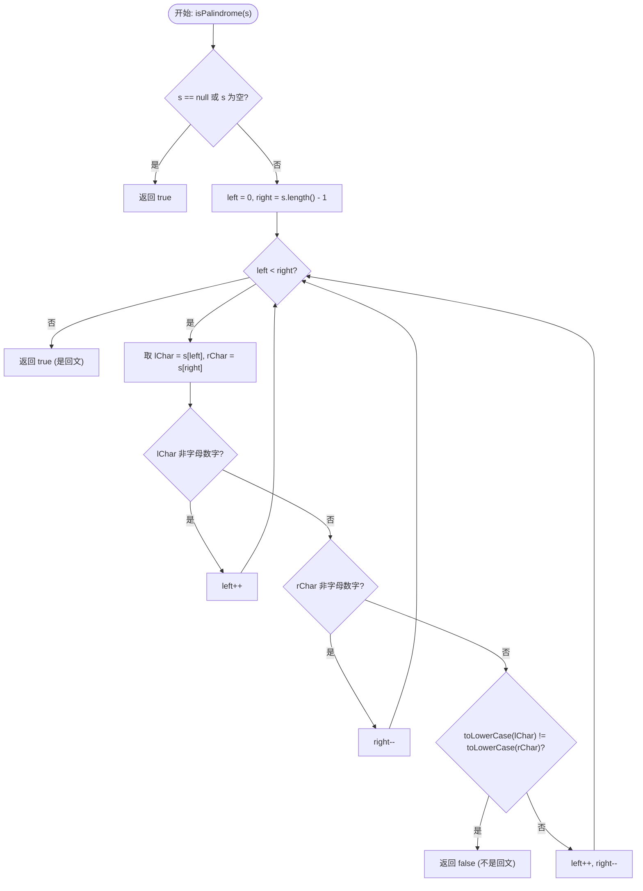

# 125. 验证回文串 (Valid Palindrome) - 详解

## 方法一：双指针法

### 1. 分析方法

核心思路：**左右指针向中间逼近，只比对字母和数字字符，忽略其他字符，且忽略大小写**。

1. **空值检查**：若字符串为 `null` 或空串，直接返回 `true`（空串视为回文）。
2. **初始化双指针**：`left = 0`（最左端），`right = s.length() - 1`（最右端）。
3. **循环比对**（`while left < right`）：
   - 左指针遇到非字母数字字符 → `left++` 跳过。
   - 右指针遇到非字母数字字符 → `right--` 跳过。
   - 都是合法字符时，统一转小写后比较：
     - 不相等 → 返回 `false`。
     - 相等 → `left++`，`right--`，继续向中间逼近。
4. **循环正常结束** → 返回 `true`，是回文串。

**时间复杂度**：O(n)，每个字符最多被访问一次。
**空间复杂度**：O(1)，只使用了常数级别的额外空间。

### 2. 详细示例推演

**输入**：`s = "A man, a plan, a canal: Panama"`

**Step 1 — 空值检查**：非 null 且长度 > 0，通过。

**Step 2 — 初始化指针**：`left = 0`，`right = 29`

**Step 3 — 逐步比较**：

| 轮次 | left | right | s[left] | s[right] | 判断 | 操作 |
|------|------|-------|---------|----------|------|------|
| 1 | 0 | 29 | `'A'` | `'a'` | 都是字母，`'a'` == `'a'` ✅ | left=1, right=28 |
| 2 | 1 | 28 | `' '` | `'m'` | 左侧非字母数字 | left=2 |
| 3 | 2 | 28 | `'m'` | `'m'` | `'m'` == `'m'` ✅ | left=3, right=27 |
| 4 | 3 | 27 | `'a'` | `'a'` | `'a'` == `'a'` ✅ | left=4, right=26 |
| 5 | 4 | 26 | `'n'` | `'n'` | `'n'` == `'n'` ✅ | left=5, right=25 |
| 6 | 5 | 25 | `','` | `'a'` | 左侧非字母数字 | left=6 |
| 7 | 6 | 25 | `' '` | `'a'` | 左侧非字母数字 | left=7 |
| 8 | 7 | 25 | `'a'` | `'a'` | `'a'` == `'a'` ✅ | left=8, right=24 |
| 9 | 8 | 24 | `' '` | `'P'` | 左侧非字母数字 | left=9 |
| 10 | 9 | 24 | `'p'` | `'P'` | `'p'` == `'p'` ✅ | left=10, right=23 |
| ... | ... | ... | ... | ... | 后续类似，持续向中间逼近 | ... |

所有合法字符对称匹配，最终 `left >= right`，循环结束。

**Step 4 — 返回 `true`** ✅ 是回文串。

---

**反例推演**：`s = "race a car"`

| 轮次 | left | right | s[left] | s[right] | 判断 | 操作 |
|------|------|-------|---------|----------|------|------|
| 1 | 0 | 9 | `'r'` | `'r'` | `'r'` == `'r'` ✅ | left=1, right=8 |
| 2 | 1 | 8 | `'a'` | `'a'` | `'a'` == `'a'` ✅ | left=2, right=7 |
| 3 | 2 | 7 | `'c'` | `'c'` | `'c'` == `'c'` ✅ | left=3, right=6 |
| 4 | 3 | 6 | `'e'` | `' '` | 右侧非字母数字 | right=5 |
| 5 | 3 | 5 | `'e'` | `'a'` | `'e'` != `'a'` ❌ | 返回 `false` |

---

**边界用例推演**：`s = " "`

- `left = 0`, `right = 0`，`left < right` 为 `false`，不进入循环。
- 返回 `true` ✅（纯空格/符号视为回文）。

### 3. 代码

```java
public boolean isPalindrome(String s) {
    if (s == null || s.length() == 0) {
        return true;
    }

    int left = 0;
    int right = s.length() - 1;

    while (left < right) {
        char lChar = s.charAt(left);
        char rChar = s.charAt(right);

        // 1. 左指针遇到非字母数字，跳过
        if (!Character.isLetterOrDigit(lChar)) {
            left++;
        }
        // 2. 右指针遇到非字母数字，跳过
        else if (!Character.isLetterOrDigit(rChar)) {
            right--;
        }
        // 3. 都是合法字符，转为小写比较
        else {
            if (Character.toLowerCase(lChar) != Character.toLowerCase(rChar)) {
                // 只要有一对对不上，就不是回文
                return false;
            }
            // 这一对匹配成功，继续向中间逼近
            left++;
            right--;
        }
    }
    return true;
}
```

> ⚠️ **注意**：原始代码中 `right++`（第 20 行）应为 `right--`，这是一个 bug。右指针应该向左移动才能跳过非法字符。

### 4. 核心流程图


