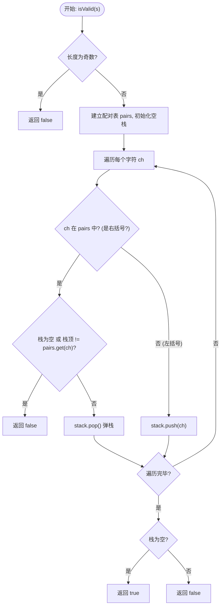
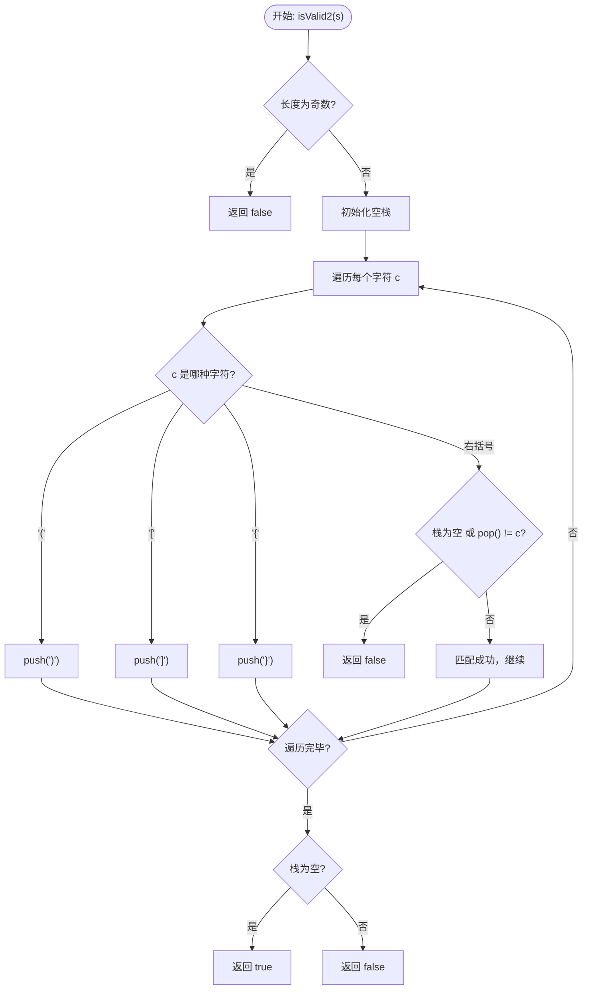

# 20. 有效的括号 (Valid Parentheses) - 详解

## 方法一：HashMap 配对表 + 栈

### 1. 分析方法

核心思路：**使用栈的"后进先出"特性来匹配括号**。右括号必须与最近的未匹配左括号配对。

1. **奇数剪枝**：字符串长度为奇数时，括号不可能完全配对，直接返回 `false`。
2. **建立配对表**：用 HashMap 存储右括号 → 左括号的映射关系，方便查询。
3. **逐字符遍历**：
   - **情况 A — 遇到右括号**（在 HashMap 中找到）：栈必须非空，且栈顶必须是对应的左括号。匹配成功则弹栈，否则返回 `false`。
   - **情况 B — 遇到左括号**（不在 HashMap 中）：直接入栈，等待被匹配。
4. **最终判断**：遍历结束后栈必须为空，否则说明有多余的左括号。

**时间复杂度**：O(n)，n 为字符串长度。
**空间复杂度**：O(n)，最坏情况全是左括号入栈。

### 2. 详细示例推演

**输入**：`s = "{[()]}"`

**Step 1 — 奇数剪枝**：长度 = 6，偶数，通过。

**Step 2 — 建立配对表**：`pairs = {')': '(', ']': '[', '}': '{'}`

**Step 3 — 初始化栈**：`stack = []`

**Step 4 — 逐字符遍历**：

| 步骤 | 字符 | 在 pairs 中? | 操作 | 栈状态 |
|-----|------|-------------|------|-------|
| 1 | `'{'` | 否（左括号） | 入栈 | `[{]` |
| 2 | `'['` | 否（左括号） | 入栈 | `[{, []` |
| 3 | `'('` | 否（左括号） | 入栈 | `[{, [, (]` |
| 4 | `')'` | 是 → 期待 `'('` | 栈顶 `'('` == `'('` ✅，弹栈 | `[{, []` |
| 5 | `']'` | 是 → 期待 `'['` | 栈顶 `'['` == `'['` ✅，弹栈 | `[{]` |
| 6 | `'}'` | 是 → 期待 `'{'` | 栈顶 `'{'` == `'{'` ✅，弹栈 | `[]` |

**Step 5 — 栈为空**：返回 `true` ✅

---

**反例推演**：`s = "([)]"`

| 步骤 | 字符 | 在 pairs 中? | 操作 | 栈状态 |
|-----|------|-------------|------|-------|
| 1 | `'('` | 否 | 入栈 | `[(]` |
| 2 | `'['` | 否 | 入栈 | `[(, []` |
| 3 | `')'` | 是 → 期待 `'('` | 栈顶 `'['` != `'('` ❌ | 返回 `false` |

**反例推演**：`s = "(("`

| 步骤 | 字符 | 操作 | 栈状态 |
|-----|------|------|-------|
| 1 | `'('` | 入栈 | `[(]` |
| 2 | `'('` | 入栈 | `[(, (]` |

遍历结束，栈非空 → 返回 `false` ❌

### 3. 代码

```java
public boolean isValid(String s) {
    int n = s.length();
    // 剪枝：奇数长度一定无效
    if (n % 2 == 1) return false;

    // 1. 建立配对表 key 是右括号，value 是对应的左括号
    Map<Character, Character> pairs = new HashMap<>();
    pairs.put(')', '(');
    pairs.put(']', '[');
    pairs.put('}', '{');

    Stack<Character> stack = new Stack<>();

    for (int i = 0; i < n; i++) {
        char ch = s.charAt(i);

        // 2. 判断当前字符
        if (pairs.containsKey(ch)) {
            // --- 情况 A：是右括号 ---
            // 栈必须非空，且栈顶必须是对应的左括号
            if (stack.isEmpty() || stack.peek() != pairs.get(ch)) {
                return false; // 匹配失败
            }
            stack.pop(); // 匹配成功，弹掉栈顶的左括号
        } else {
            // --- 情况 B：是左括号 ---
            // 直接入栈，等待被匹配
            stack.push(ch);
        }
    }
    // 3. 最后栈必须为空才算完全匹配
    return stack.isEmpty();
}
```

### 4. 核心流程图



---

## 方法二：直接压入期望的右括号

### 1. 分析方法

核心思路：**遇到左括号时，不存左括号本身，而是存入与之对应的右括号**。这样遇到右括号时，直接和栈顶比对是否相等即可，无需查表。

1. **奇数剪枝**：同方法一。
2. **遍历每个字符**：
   - 遇到 `'('` → 压入 `')'`
   - 遇到 `'['` → 压入 `']'`
   - 遇到 `'{'` → 压入 `'}'`
   - 遇到右括号 → 栈为空或 `stack.pop() != c` 则失败
3. **最终判断**：栈必须为空。

**时间复杂度**：O(n)。
**空间复杂度**：O(n)。

### 2. 详细示例推演

**输入**：`s = "()[]{}"`

| 步骤 | 字符 | 操作 | 栈状态（存的是期望的右括号） |
|-----|------|------|------------------------|
| 1 | `'('` | 压入 `')'` | `[)]` |
| 2 | `')'` | `stack.pop()` = `')'` == `')'` ✅ | `[]` |
| 3 | `'['` | 压入 `']'` | `[]` → `[]]` |
| 4 | `']'` | `stack.pop()` = `']'` == `']'` ✅ | `[]` |
| 5 | `'{'` | 压入 `'}'` | `[}]` |
| 6 | `'}'` | `stack.pop()` = `'}'` == `'}'` ✅ | `[]` |

栈为空 → 返回 `true` ✅

---

**反例推演**：`s = "(]"`

| 步骤 | 字符 | 操作 | 栈状态 |
|-----|------|------|-------|
| 1 | `'('` | 压入 `')'` | `[)]` |
| 2 | `']'` | `stack.pop()` = `')'` != `']'` ❌ | 返回 `false` |

### 3. 代码

```java
public boolean isValid2(String s) {
    // 剪枝：如果是奇数长度，肯定无法一一配对
    if (s.length() % 2 != 0) return false;

    Stack<Character> stack = new Stack<>();

    for (char c : s.toCharArray()) {
        if (c == '(') {
            stack.push(')'); // 遇到左，存对应的右
        } else if (c == '[') {
            stack.push(']');
        } else if (c == '{') {
            stack.push('}');
        } else { // 遇到右括号了，进行两步判断：
            // 1. stack.isEmpty(): 说明右括号多了
            // 2. stack.pop() != c: 说明左右不匹配
            if (stack.isEmpty() || stack.pop() != c) {
                return false;
            }
        }
    }
    // 最后必须栈空才算成功
    return stack.isEmpty();
}
```

### 4. 核心流程图



---

## 两种方法对比

| 维度 | 方法一：HashMap 配对表 | 方法二：直接压入期望值 |
|------|-------------------|-------------------|
| 查表方式 | HashMap 查找右括号对应左括号 | 无需查表，压入时已确定期望值 |
| 匹配逻辑 | 栈顶(左括号) vs pairs.get(右括号) | 栈顶(期望值) vs 当前右括号 |
| 可扩展性 | 新增括号类型只需改 HashMap | 需要增加 if-else 分支 |
| 代码简洁度 | 略长但灵活 | 更简洁直观 |
| 时间/空间复杂度 | O(n) / O(n) | O(n) / O(n) |
