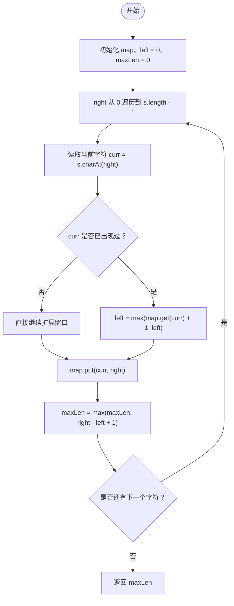

# LeetCode 3 - 无重复字符的最长子串

## 题目描述

给定一个字符串 `s`，请你找出其中不含有重复字符的最长子串的长度。

示例：

- 输入：`s = "abcabcbb"`
- 输出：`3`
- 解释：最长无重复子串是 `"abc"`，长度为 `3`。

---

## 1. 解法：滑动窗口 + 哈希表

### 1.1 方法分析

这份代码的核心思想是维护一个“当前不含重复字符的窗口”。

- 用 `left` 表示窗口左边界。
- 用 `right` 表示窗口右边界，负责从左到右遍历字符串。
- 用 `map` 记录每个字符最近一次出现的位置。
- 用 `maxLen` 记录遍历过程中出现过的最大窗口长度。

当 `right` 扫到一个新字符 `curr` 时，有两种情况：

- 如果 `curr` 没出现过，或者它上次出现的位置已经在窗口左边界之外，那么当前窗口仍然合法，可以继续扩大。
- 如果 `curr` 在当前窗口内部出现过，说明窗口里出现重复字符，此时必须移动 `left`，把左边界跳到“上一次重复字符位置的下一位”。

这里最关键的一句是：

```java
left = Math.max(map.get(curr) + 1, left);
```

必须取 `max`，因为字符上一次出现的位置可能已经在旧窗口之外，不能让 `left` 倒退。

### 1.2 核心流程

1. 初始化 `map`、`left = 0`、`maxLen = 0`。
2. 枚举每个右边界 `right`。
3. 如果当前字符 `curr` 已经在 `map` 中出现过，就更新左边界 `left`。
4. 把当前字符的最新位置写回 `map`。
5. 计算当前窗口长度 `right - left + 1`，更新 `maxLen`。
6. 遍历结束后返回 `maxLen`。

### 1.3 代码

```java
import java.util.HashMap;
import java.util.Map;

public class lengthOfLongestSubstring3 {
    public int lengthOfLongestSubstring(String s){
        if(s.length()==0) return 0;

        // map 记录字符最后一次出现的索引位置
        Map<Character,Integer> map=new HashMap<>();

        int maxLen=0;
        int left=0;

        for(int right=0;right<s.length();right++){
            char curr=s.charAt(right);

            if(map.containsKey(curr)){
                left=Math.max(map.get(curr)+1,left);
            }

            map.put(curr,right);
            maxLen=Math.max(maxLen,right-left+1);
        }
        return maxLen;
    }
}
```

### 1.4 示例详细推演

下面用 `s = "abcabcbb"` 详细推演整段代码的执行过程。

初始状态：

- `left = 0`
- `maxLen = 0`
- `map = {}`

| 步骤 | `right` | 当前字符 | 是否重复 | `left` 更新后 | `map` 更新后 | 当前窗口 | 当前长度 | `maxLen` |
| --- | --- | --- | --- | --- | --- | --- | --- | --- |
| 1 | 0 | `a` | 否 | 0 | `{a=0}` | `"a"` | 1 | 1 |
| 2 | 1 | `b` | 否 | 0 | `{a=0, b=1}` | `"ab"` | 2 | 2 |
| 3 | 2 | `c` | 否 | 0 | `{a=0, b=1, c=2}` | `"abc"` | 3 | 3 |
| 4 | 3 | `a` | 是 | `max(0+1, 0)=1` | `{a=3, b=1, c=2}` | `"bca"` | 3 | 3 |
| 5 | 4 | `b` | 是 | `max(1+1, 1)=2` | `{a=3, b=4, c=2}` | `"cab"` | 3 | 3 |
| 6 | 5 | `c` | 是 | `max(2+1, 2)=3` | `{a=3, b=4, c=5}` | `"abc"` | 3 | 3 |
| 7 | 6 | `b` | 是 | `max(4+1, 3)=5` | `{a=3, b=6, c=5}` | `"cb"` | 2 | 3 |
| 8 | 7 | `b` | 是 | `max(6+1, 5)=7` | `{a=3, b=7, c=5}` | `"b"` | 1 | 3 |

最终返回 `3`。

### 1.5 为什么 `left` 不能直接赋值

看一个容易出错的例子：`s = "abba"`。

当遍历到最后一个 `a` 时：

- `a` 上次出现的位置是 `0`
- 但此时窗口左边界已经因为前面的重复 `b` 被推进到了 `2`

如果你直接写：

```java
left = map.get(curr) + 1;
```

那么 `left` 会从 `2` 倒退回 `1`，窗口就错了。

所以必须写成：

```java
left = Math.max(map.get(curr) + 1, left);
```

这样才能保证窗口左边界只会向右移动，不会回退。

### 1.6 复杂度分析

- 时间复杂度：`O(n)`  
  每个字符最多被遍历一次，哈希表查询和更新平均是 `O(1)`。
- 空间复杂度：`O(k)`  
  `k` 是窗口中不同字符的数量，最坏情况下可视为 `O(n)`。

### 1.7 核心流程图



---

## 2. 总结

这道题的关键不是“发现重复字符”，而是“发现重复字符后如何正确移动左边界”。

这份代码使用滑动窗口维护一个始终无重复的区间，再用哈希表快速定位重复字符上一次出现的位置，因此可以在线性时间内完成求解。
