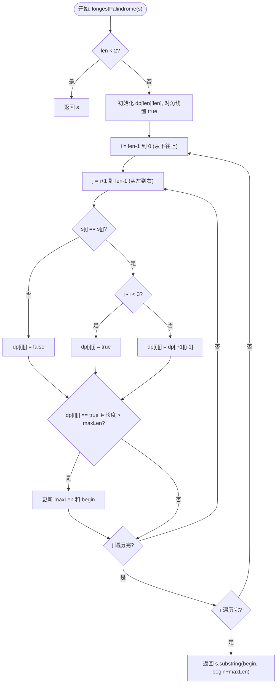
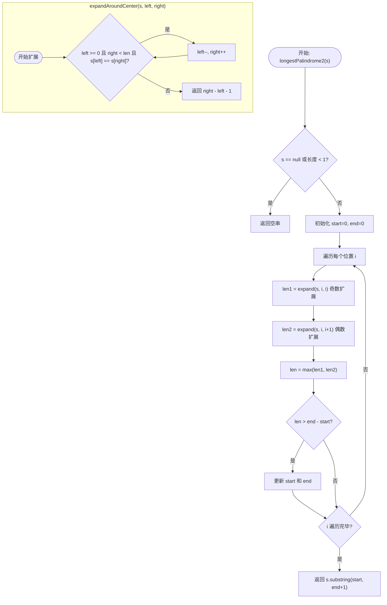

# 5. 最长回文子串 (Longest Palindromic Substring) - 详解

## 方法一：动态规划法（DP）

### 1. 分析方法

核心思路：**用二维布尔数组 `dp[i][j]` 表示子串 `s[i..j]` 是否为回文串**，通过状态转移逐步填表。

**状态定义**：`dp[i][j] = true` 表示 `s[i..j]` 是回文串。

**状态转移方程**：
- 若 `s[i] != s[j]`：`dp[i][j] = false`
- 若 `s[i] == s[j]`：
  - 子串长度 < 3（即 `j - i < 3`，如 `"aa"` 或 `"aba"`）：`dp[i][j] = true`
  - 子串长度 ≥ 3：`dp[i][j] = dp[i+1][j-1]`（取决于去掉首尾后的内核是否回文）

**填表顺序**：`i` 从下往上（`len-1 → 0`），`j` 从 `i+1` 往右，确保计算 `dp[i][j]` 时 `dp[i+1][j-1]` 已求得。

**步骤**：
1. **初始化**：所有长度为 1 的子串都是回文串，`dp[i][i] = true`。
2. **填表**：按上述顺序填，同时记录最长回文的起点 `begin` 和长度 `maxLen`。
3. **返回结果**：`s.substring(begin, begin + maxLen)`。

**时间复杂度**：O(n²)。
**空间复杂度**：O(n²)。

### 2. 详细示例推演

**输入**：`s = "babad"`，长度 `len = 5`

**Step 1 — 初始化对角线**：

|   | 0(b) | 1(a) | 2(b) | 3(a) | 4(d) |
|---|------|------|------|------|------|
| **0(b)** | T | | | | |
| **1(a)** | | T | | | |
| **2(b)** | | | T | | |
| **3(a)** | | | | T | |
| **4(d)** | | | | | T |

初始：`maxLen = 1`, `begin = 0`

**Step 2 — 填表（i 从 4 到 0，j 从 i+1 到 4）**：

**i=4**：无 j > 4 的列，跳过。

**i=3**：
- j=4：`s[3]='a'`, `s[4]='d'` → 不等 → `dp[3][4] = false`

**i=2**：
- j=3：`s[2]='b'`, `s[3]='a'` → 不等 → `dp[2][3] = false`
- j=4：`s[2]='b'`, `s[4]='d'` → 不等 → `dp[2][4] = false`

**i=1**：
- j=2：`s[1]='a'`, `s[2]='b'` → 不等 → `dp[1][2] = false`
- j=3：`s[1]='a'`, `s[3]='a'` → 相等，`j-i=2 < 3`？否(=2)，`3-1=2 < 3`？是 → `dp[1][3] = true` ✅
  - 长度 = 3 > maxLen(1) → **更新 maxLen=3, begin=1**
- j=4：`s[1]='a'`, `s[4]='d'` → 不等 → `dp[1][4] = false`

**i=0**：
- j=1：`s[0]='b'`, `s[1]='a'` → 不等 → `dp[0][1] = false`
- j=2：`s[0]='b'`, `s[2]='b'` → 相等，`j-i=2 < 3`？是 → `dp[0][2] = true` ✅
  - 长度 = 3 = maxLen(3)，不更新
- j=3：`s[0]='b'`, `s[3]='a'` → 不等 → `dp[0][3] = false`
- j=4：`s[0]='b'`, `s[4]='d'` → 不等 → `dp[0][4] = false`

**最终 dp 表**：

|   | 0(b) | 1(a) | 2(b) | 3(a) | 4(d) |
|---|------|------|------|------|------|
| **0(b)** | T | F | **T** | F | F |
| **1(a)** | | T | F | **T** | F |
| **2(b)** | | | T | F | F |
| **3(a)** | | | | T | F |
| **4(d)** | | | | | T |

**Step 3 — 返回结果**：`s.substring(1, 1+3)` = `"bab"` ✅

（注：`"aba"` 同样是合法答案，即 `dp[0][2]` 也为 `true`）

### 3. 代码

```java
public String longestPalindrome(String s) {
    int len = s.length();
    if (len < 2) {
        return s;
    }

    int maxLen = 1;
    int begin = 0;

    // 1. 定义 dp 表
    // dp[i][j] 表示 s[i..j] 是否为回文串
    boolean[][] dp = new boolean[len][len];

    // 2. 初始化：所有长度为 1 的子串都是回文串
    for (int i = 0; i < len; i++) {
        dp[i][i] = true;
    }

    // 3. 开始填表
    // i 要从下往上找 (len-1 -> 0)
    for (int i = len - 1; i >= 0; i--) {
        // j 要从 i 往右找
        for (int j = i + 1; j < len; j++) {
            // 核心判断逻辑
            if (s.charAt(i) != s.charAt(j)) {
                dp[i][j] = false;
            } else {
                // 字符相等，分两种情况：
                // A. 长度小于 3 (如 "aa", "aba")，直接 true
                // B. 长度 >= 3，查左下角的内核 dp[i+1][j-1]
                if (j - i < 3) {
                    dp[i][j] = true;
                } else {
                    dp[i][j] = dp[i + 1][j - 1];
                }
            }

            // 4. 只要 dp[i][j] 是 true，就看看是不是最长的
            if (dp[i][j] && (j - i + 1 > maxLen)) {
                maxLen = j - i + 1;
                begin = i;
            }
        }
    }
    return s.substring(begin, begin + maxLen);
}
```

### 4. 核心流程图



---

## 方法二：中心扩展法

### 1. 分析方法

核心思路：**回文串关于中心对称**。以每个位置为中心，向两边扩展，找到以该位置为中心的最长回文串。

需要同时处理两种情况：
- **奇数长度回文**：中心是一个字符，如 `"aba"` 的中心是 `'b'`。
- **偶数长度回文**：中心是两个字符之间的间隙，如 `"abba"` 的中心在两个 `'b'` 之间。

**步骤**：
1. 遍历每个位置 `i`：
   - 以 `(i, i)` 为中心扩展 → 得到奇数长度回文 `len1`。
   - 以 `(i, i+1)` 为中心扩展 → 得到偶数长度回文 `len2`。
   - 取较大者 `len = max(len1, len2)`。
2. 更新全局最长的 `start` 和 `end`。
3. 辅助函数 `expandAroundCenter(s, left, right)` 返回扩展后的回文长度。

**时间复杂度**：O(n²)。
**空间复杂度**：O(1)。

### 2. 详细示例推演

**输入**：`s = "babad"`，长度 = 5

**初始**：`start = 0`, `end = 0`

---

**i=0** (字符 `'b'`)：
- 奇数扩展 `expand(s, 0, 0)`：
  - `left=0, right=0`: `s[0]='b'==s[0]='b'` ✅ → res=1, left=-1, right=1
  - `left=-1`: 越界，停止 → 返回长度 = `1-(-1)-1 = 1`
- 偶数扩展 `expand(s, 0, 1)`：
  - `left=0, right=1`: `s[0]='b'` != `s[1]='a'` ❌ → 返回长度 = `1-0-1 = 0`
- `len = max(1, 0) = 1`，`1 > end-start(=0)`？是 → `start=0, end=0`

---

**i=1** (字符 `'a'`)：
- 奇数扩展 `expand(s, 1, 1)`：
  - `left=1, right=1`: `'a'=='a'` ✅ → left=0, right=2
  - `left=0, right=2`: `s[0]='b'==s[2]='b'` ✅ → left=-1, right=3
  - `left=-1`: 越界 → 返回长度 = `3-(-1)-1 = 3`
- 偶数扩展 `expand(s, 1, 2)`：
  - `left=1, right=2`: `s[1]='a'` != `s[2]='b'` ❌ → 返回长度 = `2-1-1 = 0`
- `len = max(3, 0) = 3`，`3 > end-start(=0)`？是 → `start = 1-(3-1)/2 = 0`, `end = 1+3/2 = 2`

当前最长回文：`s[0..2]` = `"bab"` ✅

---

**i=2** (字符 `'b'`)：
- 奇数扩展 `expand(s, 2, 2)`：
  - `left=2, right=2`: `'b'=='b'` ✅ → left=1, right=3
  - `left=1, right=3`: `s[1]='a'==s[3]='a'` ✅ → left=0, right=4
  - `left=0, right=4`: `s[0]='b'` != `s[4]='d'` ❌ → 返回长度 = `4-0-1 = 3`
- 偶数扩展 `expand(s, 2, 3)`：
  - `left=2, right=3`: `s[2]='b'` != `s[3]='a'` ❌ → 返回长度 = `3-2-1 = 0`
- `len = max(3, 0) = 3`，`3 > end-start(=2)`？否，不更新。

---

**i=3** (字符 `'a'`)：
- 奇数扩展 `expand(s, 3, 3)` → 长度 1
- 偶数扩展 `expand(s, 3, 4)` → 长度 0
- `len = 1`，不更新。

**i=4** (字符 `'d'`)：
- 奇数扩展 `expand(s, 4, 4)` → 长度 1
- 偶数扩展 `expand(s, 4, 5)` → 越界，长度 0
- `len = 1`，不更新。

**最终结果**：`s.substring(0, 2+1)` = `"bab"` ✅

### 3. 代码

```java
public String longestPalindrome2(String s) {
    if (s == null || s.length() < 1) {
        return "";
    }

    // 记录最长回文子串的起始索引和结束索引
    int start = 0;
    int end = 0;

    for (int i = 0; i < s.length(); i++) {
        // 1. 以 i 为中心扩散 (处理奇数长度，如 "aba")
        int len1 = expandAroundCenter(s, i, i);

        // 2. 以 i 和 i+1 为中心扩散 (处理偶数长度，如 "abba")
        int len2 = expandAroundCenter(s, i, i + 1);

        // 取两种情况中更长的那个
        int len = Math.max(len1, len2);

        // 如果找到了更长的回文串，更新 start 和 end
        if (len > end - start) {
            start = i - (len - 1) / 2;
            end = i + len / 2;
        }
    }
    // substring 是"包头不包尾"的，所以 end 要 +1
    return s.substring(start, end + 1);
}

/**
 * 辅助函数：从 left 和 right 开始向两边扩散
 * 返回扩散后的回文串长度
 */
private int expandAroundCenter(String s, int left, int right) {
    // 当索引没越界，且左右字符相等时，继续扩
    while (left >= 0 && right < s.length() && s.charAt(left) == s.charAt(right)) {
        left--;
        right++;
    }
    // 循环结束时，left 和 right 已经多走了一步
    // 长度计算：(right - 1) - (left + 1) + 1 = right - left - 1
    return right - left - 1;
}
```

### 4. 核心流程图



---

## 两种方法对比

| 维度 | 方法一：动态规划 | 方法二：中心扩展 |
|------|--------------|--------------|
| 思维模型 | 自底向上填 dp 表 | 枚举中心向外扩展 |
| 时间复杂度 | O(n²) | O(n²) |
| 空间复杂度 | O(n²)（二维数组） | O(1)（常数空间） |
| 优势 | dp 表可复用于扩展问题 | 空间更优，常数更小 |
| 推荐场景 | 学习 DP 思想时使用 | 面试首选（简洁高效） |
