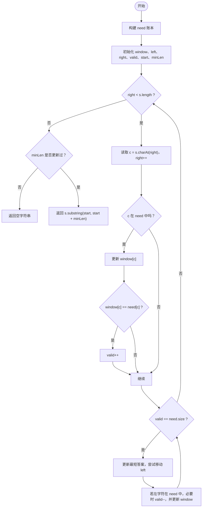

# LeetCode 76 - 最小覆盖子串

## 题目描述

给你两个字符串 `s` 和 `t`。请你在 `s` 中找出包含 `t` 所有字符的最小子串。

注意：

- `t` 中如果某个字符出现了多次，那么结果子串中也必须至少包含同样多次。
- 如果 `s` 中不存在这样的子串，返回空字符串 `""`。

示例：

- 输入：`s = "ADOBECODEBANC"`, `t = "ABC"`
- 输出：`"BANC"`

---

## 1. 解法：滑动窗口 + 两张哈希表

### 1.1 方法分析

这道题的核心，不是单纯判断“字符有没有出现”，而是判断：

- `t` 里需要哪些字符
- 每个字符分别需要多少个
- 当前窗口里这些字符是否都已经满足要求

因此代码使用了两张哈希表：

- `need`：记录 `t` 中每个字符需要多少次
- `window`：记录当前窗口中每个相关字符出现了多少次

同时再用一个变量：

- `valid`：表示当前有多少种字符已经“达标”了

这里的“达标”意思是：

```text
window.get(c) == need.get(c)
```

当 `valid == need.size()` 时，说明 `t` 中要求的每一种字符都满足了，当前窗口就是一个合法覆盖窗口。

接下来就可以尝试缩小左边界，寻找更短的合法子串。

### 1.2 整体思路

代码的执行节奏分成两层：

1. 外层 `while(right < s.length())`
   右指针不断向右扩张窗口，把字符纳入窗口。

2. 内层 `while(valid == need.size())`
   一旦窗口已经满足覆盖条件，就不断移动左指针，尝试把窗口缩到最短。

所以它的本质是：

- 先扩张，直到“够用”
- 再收缩，直到“刚好不够用”
- 在这个过程中记录最短合法窗口

### 1.3 变量含义

- `need`：目标账本，记录 `t` 中每个字符的需求次数
- `window`：窗口账本，记录当前窗口内相关字符出现次数
- `left`：窗口左边界
- `right`：窗口右边界，注意代码里它始终指向窗口右侧的下一个位置
- `valid`：当前已经满足要求的字符种类数
- `start`：目前最优答案的起点
- `minLen`：目前最优答案的长度

### 1.4 代码

```java
import java.util.HashMap;
import java.util.Map;

public class minWindow76 {
    public String minWindow(String s,String t){
        if(s==null ||s.length()==0||t==null||t.length()==0){
            return "";
        }

        // 1. 准备 need 账本，记录 t 中每个字符需要的数量
        Map<Character,Integer> need=new HashMap<>();
        for(char c:t.toCharArray()){
            need.put(c,need.getOrDefault(c,0)+1);
        }

        // 2. 准备 window 账本，记录当前窗口中的字符数量
        Map<Character,Integer> window=new HashMap<>();

        int left=0,right=0;
        int valid=0;

        // 记录最小子串的起始位置和长度
        int start=0;
        int minLen=Integer.MAX_VALUE;

        while(right<s.length()){
            char c=s.charAt(right);
            right++;

            if(need.containsKey(c)){
                window.put(c,window.getOrDefault(c,0)+1);
                if(window.get(c).equals(need.get(c))){
                    valid++;
                }
            }

            while(valid==need.size()){
                if(right-left<minLen){
                    start=left;
                    minLen=right-left;
                }

                char d=s.charAt(left);
                left++;

                if(need.containsKey(d)){
                    if(window.get(d).equals(need.get(d))){
                        valid--;
                    }
                    window.put(d,window.get(d)-1);
                }
            }
        }
        return minLen==Integer.MAX_VALUE ? "" : s.substring(start, start + minLen);
    }
}
```

### 1.5 为什么 `valid` 统计的是“种类数”而不是“字符总数”

假设：

- `t = "AABC"`

那么：

- `A` 需要 2 次
- `B` 需要 1 次
- `C` 需要 1 次

这里真正要满足的是 3 种字符的需求，而不是简单累计字符总个数。

所以 `valid` 表示“有多少种字符已经满足了要求”，这样判断条件才能直接写成：

```java
valid == need.size()
```

这表示：

- `need` 中每一种字符都达标了
- 当前窗口已经完整覆盖 `t`

### 1.6 为什么比较数量时要用 `equals`

代码里用了：

```java
if(window.get(c).equals(need.get(c)))
```

而不是 `==`。

原因是 `window.get(c)` 和 `need.get(c)` 的类型都是 `Integer` 对象。用 `==` 比较的是对象引用，不是数值本身。虽然某些小整数在 Java 里会被缓存，但写法上仍然应该使用 `equals`，这样才是稳定正确的。

### 1.7 示例详细推演

下面用经典例子：

- `s = "ADOBECODEBANC"`
- `t = "ABC"`

先构造 `need`：

- `A:1`
- `B:1`
- `C:1`

所以：

- `need.size() = 3`
- 当 `valid == 3` 时，窗口合法

初始状态：

- `left = 0`
- `right = 0`
- `valid = 0`
- `start = 0`
- `minLen = INF`

#### 第一阶段：扩张到第一个合法窗口

1. `right = 0`，加入 `A`
   - `window[A] = 1`
   - `window[A] == need[A]`
   - `valid = 1`
   - 当前窗口：`"A"`

2. 加入 `D`
   - `D` 不在 `need` 中，忽略
   - 当前窗口：`"AD"`

3. 加入 `O`
   - 忽略
   - 当前窗口：`"ADO"`

4. 加入 `B`
   - `window[B] = 1`
   - `valid = 2`
   - 当前窗口：`"ADOB"`

5. 加入 `E`
   - 忽略
   - 当前窗口：`"ADOBE"`

6. 加入 `C`
   - `window[C] = 1`
   - `valid = 3`
   - 当前窗口：`"ADOBEC"`

这时窗口已经覆盖了 `A、B、C`，进入收缩阶段。

#### 第二阶段：第一次收缩

当前窗口：`"ADOBEC"`，长度 `6`

- 更新答案：`minLen = 6`，`start = 0`

开始移动 `left`：

1. 移出 `A`
   - 移出前 `window[A] == need[A]`
   - 所以移出后将不再满足要求
   - `valid` 从 `3` 变成 `2`

此时窗口失效，停止收缩。

#### 第三阶段：继续扩张，寻找更优解

继续向右扩：

7. 加入 `O`，忽略
8. 加入 `D`，忽略
9. 加入 `E`，忽略
10. 加入 `B`
    - `window[B]` 变成 `2`
    - 但这不会增加 `valid`，因为 `B` 之前已经达标了
11. 加入 `A`
    - `window[A]` 再次达到需求
    - `valid = 3`

现在窗口重新合法，对应子串大致是：`"DOBECODEBA"`

开始继续收缩左边界：

- 移出 `D`，合法
- 移出 `O`，合法
- 移出 `B`，仍合法，因为窗口里还有另一个 `B`
- 移出 `E`，合法
- 移出 `C` 之前，窗口是 `"CODEBA"` 或更小范围中的合法窗口
- 一旦移出导致某个必要字符不够，`valid` 会减 1，停止收缩

#### 第四阶段：得到最优答案 `BANC`

继续向右扩到：

- 加入 `N`
- 加入 `C`

此时再次满足覆盖条件，然后不断收缩左边界。

最终会得到合法窗口：

- `"BANC"`

它的长度是 `4`，并且已经无法再缩短，所以最终答案就是：

```text
"BANC"
```

### 1.8 用一个更小例子理解“收缩时机”

看这个例子：

- `s = "aabdec"`
- `t = "abc"`

当窗口第一次包含 `a、b、c` 后，并不说明当前窗口就是最优答案。

你必须继续移动 `left`，把左边那些“多余字符”尽可能删掉，直到再删一个就不满足覆盖条件为止。这个“缩到极限”的动作，就是本题最核心的步骤。

### 1.9 复杂度分析

- 时间复杂度：`O(|s| + |t|)`  
  `right` 和 `left` 都只会单调向右移动，每个字符最多进窗一次、出窗一次。
- 空间复杂度：`O(|Σ_t|)`  
  主要是 `need` 和 `window` 两张哈希表，大小与 `t` 中涉及的字符种类数有关。

### 1.10 核心流程图



---

## 2. 总结

这道题的本质，是在 `s` 中维护一个动态窗口，并不断判断它是否已经完整覆盖了 `t` 的字符需求。

代码之所以高效，是因为它没有反复重新统计整个窗口，而是通过：

- `need` 记录目标需求
- `window` 记录当前状态
- `valid` 快速判断窗口是否达标

从而把问题压缩成了标准的滑动窗口模型：先扩张得到合法解，再收缩逼近最优解。
